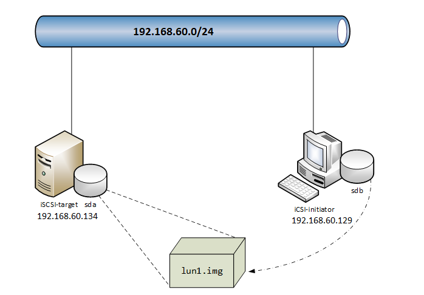

## Chia sẻ bộ nhớ qua mạng với iSCSI

1. [iSCSI là gi](#define)
2. [Cơ chế hoạt động](#work_flow)
3. [Lab iSCSI](#lab)

<a name="define"></a>
## 1. iSCSI là gì
iSCSI (internet Small Computer System Interface) là một chuẩn giao thức phát triển nhằm mục tiêu truyền tải các lệnh SCSI qua mạng bằng giao thức TCP/IP. 

iSCSI cho phép truy cập các khối dữ liệu trên hệ thống lưu trữ SAN qua các lệnh SCSI và truyền tải dữ liệu qua hệ thống mạng network (LAN/WAN).

iSCSI sẽ giúp tạo 1 ổ cứng Local trong máy tính của bạn với mọi chức năng y như 1 ổ cứng gắn trong máy tính vậy. Chỉ khác ở chỗ dung lượng thực tế nằm trên NAS và do NAS quản lý.

<a name="work_flow"></a>
## 2. Cơ chế hoạt động

* Khi một người dùng hoặc một ứng dụng gửi một request yêu cầu truy xuất dữ liệu trong Storage
* Hệ thống sẽ tạo ra một số lệnh SCSI tướng ứng với yêu cầu
* Sau đó đóng gói, mã hóa và gửi đi trên đường Network
* Khi server nhận được sẽ mở gói, giải mã và nhận được các lệnh SCSI 
* Các lệnh này sẽ được đưa vào SCSI Controller để thực thi và sử lý yêu cầu.
* Các ổ đĩa iSCSI được tạo ra từ các Server chạy các hệ điều hành như windows/linux


<a name="lab"></a>
## 3. Lab iSCSI

Mô hình trên ubuntu 16.04:  



### Requirements


Target (Server):

	Ubuntu 16.04
	ip: 192.168.60.134

Initiator (Client):

	Ubuntu 16.04
	ip: 192.168.60.129

### Installation

#### Trên Target

Cài đặt iSCSI:

	sudo apt-get update -y
	sudo apt-get install iscsitarget iscsitarget-dkms -y

Tạo một thư mục để chứa các image, mỗi image này sẽ được chia sẻ với các máy initiator và được coi như một ổ ảo trên máy đó

	sudo mkdir /storage

Sử dụng lệnh `dd` để tạo ra các image trong `/storage`, ở đây tôi lab với nên sẽ tạo một file 10M cho nhanh và nhẹ.

	sudo dd if=/dev/zero of=/storage/lun1.img bs=10kB count=1000

Sửa file `/etc/default/iscsitarget`:

	ISCSITARGET_ENABLE=true

Cấu hình file `/etc/iet/ietd.conf` để khai báo iSCSI taget vừa tạo:

	Target iqn.2017-07.ttp.vn:storage.lun1
	# cung cấp đường dẫn tới thiết bị iSCSI tartget 
	Lun 0 Path=/storage/lun1.img,Type=fileio
	# khai báo địa chỉ IP của máy iSCSI Initiator mà cho phép kết nối
	initiator-address 192.168.60.129
	# thông tin để xác thực (username và password). Lưu ý, đây là username trên máy initiator.
	incominguser trangnth abc

Khởi động lại dịch vụ:

	systemctl restart iscsitarget.service

Kiểm tra lại:

```sh
$ ss -atnp | grep 3260 # 3260 la port iSCSI service
LISTEN     0      32           *:3260                     *:*                   users:(("ietd",pid=1466,fd=7))
TIME-WAIT  0      0      192.168.60.134:3260               192.168.60.129:47924              
ESTAB      0      0      192.168.60.134:3260               192.168.60.129:47926              
LISTEN     0      32          :::3260                    :::*                   users:(("ietd",pid=1466,fd=8))
```

#### Trên Initiator

Cài đặt iSCSI:

	sudo apt-get install open-iscsi -y

Sửa file `/etc/iscsi/iscsid/conf`

	[...]
	node.startup = automatic
	[...]

Khởi động lại:

	systemctl restart open-iscsi.service

Kiểm tra lại xem đã kết nối tới server chưa, sử dụng một trong 2 lệnh sau:

	$ iscsiadm -m discovery -t st -p 192.168.60.134
	$ iscsiadm -m node
	192.168.60.134:3260,1 iqn.2017-07.ttp.vn:storage.lun1

Cấu hình username và password của initiator để login vào server:

	$ iscsiadm -m node --targetname "iqn.2017-07.ttp.vn:storage.lun1" --portal "10.10.10.10:3260" --op=update --name node.session.auth.username --value=trangnth
	$ iscsiadm -m node --targetname "iqn.2017-07.ttp.vn:storage.lun1" --portal "10.10.10.10:3260" --op=update --name node.session.auth.password --value=abc

Hoặc có thể chỉnh sửa trong file với các thông tin:

	$ vim /etc/iscsi/nodes/iqn.2017-07.ttp.vn:storage.lun1/192.168.60.134,3260,1/default
	node.session.auth.authmethod = CHAP
	node.session.auth.username = trangnth
	node.session.auth.password = abc

Sau khi xác thực xong thông tin thì login vào để sử dụng:

	$ iscsiadm -m node --targetname "iqn.2017-07.ttp.vn:storage.lun1" --portal "10.10.10.10:3260" --login
	Logging in to [iface: default, target: iqn.2017-07.ttp.vn:storage.lun1, portal: 192.168.60.134,3260] (multiple)
	Login to [iface: default, target: iqn.2017-07.ttp.vn:storage.lun1, portal: 192.168.60.134,3260] successful.

Kiểm tra lại:

```sh
$ !l
lsblk 
NAME                            MAJ:MIN RM  SIZE RO TYPE MOUNTPOINT
sda                               8:0    0   20G  0 disk 
├─sda1                            8:1    0  487M  0 part /boot
├─sda2                            8:2    0    1K  0 part 
└─sda5                            8:5    0 19.5G  0 part 
  ├─intern--meditech--vg-root   252:0    0   19G  0 lvm  /
  └─intern--meditech--vg-swap_1 252:1    0  512M  0 lvm  [SWAP]
sdb                               8:16   0  9.5M  0 disk 
sr0                              11:0    1  655M  0 rom 
```

Chúng ta sẽ nhìn thấy có thêm một ổ mới `sdb` với dung lượng 9.5M chính là image `lun1.img` bên target. `sdb` sẽ đóng vai trò như một ổ thật và có thể sử dụng nó bình thường như những ổ khác nhưng dữ liệu trên đó thực sự lại được lưu trên máy target. Lúc này dung lượng được lấy từ máy target và chia sẻ với máy initiator qua giao thức iSCSI. 

## Tham khảo

Tôi Lab theo [bài này](https://github.com/hocchudong/thuctap012017/blob/master/TamNT/Tim_hieu_iSCSI.md)