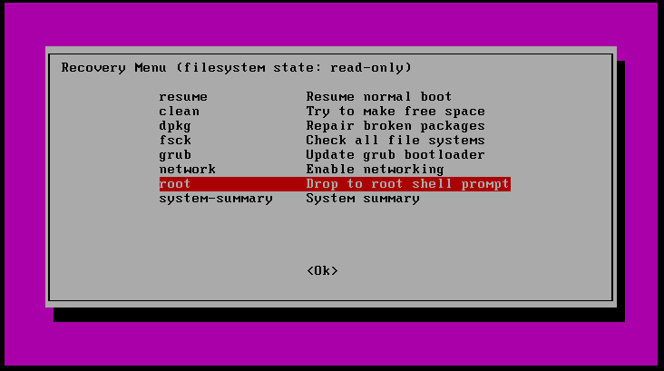
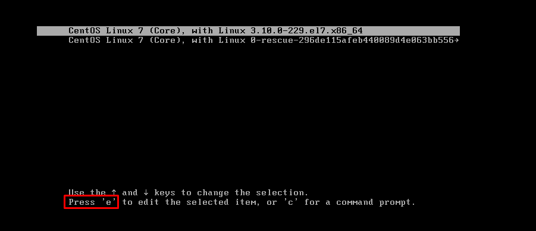
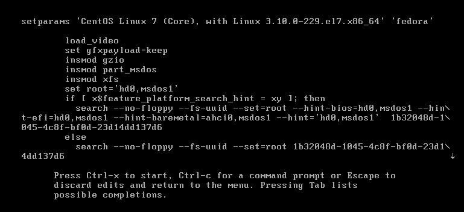
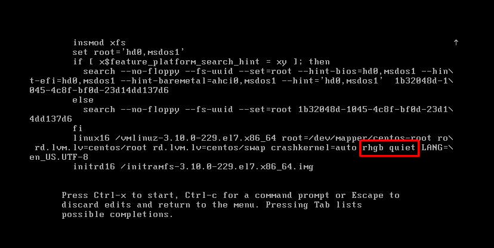
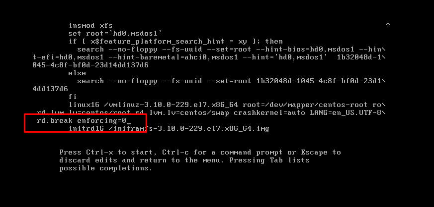
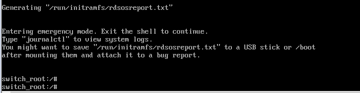
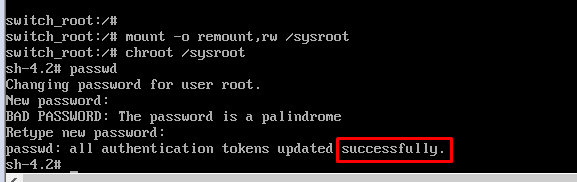

## File shadow note

Cấu trúc file /etc/shadow

	Username:Password-encode:last_pass_change:maxday:maximum:warn:inactive:expire

Trong đó:

1. Username : Tên người dùng.

2. Password-encode : Mật khẩu người sử dụng được mã hóa bởi các thuật toán khác nhau tùy từng distro.
         $1$i.c8pVks$KGiRzVYjr8uRZUYzwQxcL1
* Được phân cách thành 3 trường bởi $.
    * Trường 1: Cho biết thuật toán mã hóa.

            $1 : MD5
            $2 : blowfish
            $2a : eksblowfish
            $5 : sha256
            $6 : sha512
    
    * Trường 2: Là một chuỗi dữ liệu ngẫu nhiên (salt) kết hợp với pass người dùng, tăng tính bảo mật trong hàm băm.
    * Trường 3: Giá trị băm của salt với password

* Nếu tại password-encode mà:

	* `rỗng`, nghĩa là không có mật khẩu.
	* `!` , nghĩa là mật khẩu người dùng bị chặn, nhưng có thể sử dụng phương thức khác để connect, như ssh key.
	* `*`, nghĩa là mật khẩu bị chặn, vẫn có thể connect bằng phương thức khác.

3. last_pass_change : Thời gian từ ngày 1/1/1970 tới lần thay đổi mật khẩu gần nhất (tính bằng ngày).

4. maxday : Thời gian tối đa để thay đôi mật khẩu. 0 là thay đổi bất kỳ lúc nào ( tính bằng ngày ).

5. maximum : Thời gian mật khẩu còn thời hạn ( tính bằng ngày ).

6. warn : Thời gian cảnh báo mật khẩu sắp hết hạn ( tính bằng ngày)

7. inactive : Thời gian mà mật khẩu người dùng hết hạn (tính bằng ngày )

8. expire : Thời gian mà người dùng bị vô hiêu hóa, tính từ ngày 1/1/1970 ( tính bằng ngày ).

Sử dụng lệnh sau để mã hóa password rồi copy vào file /etc/shadow nếu muốn thay đổi pass của user nào đó:

	$ mkpasswd -m md5 <password>

Ví dụ:

	mkpasswd -m md5 abc
	$1$uLLQhRT3$Q4VWLobC21SxPlkM83IKw0

Copy đoạn mã được sinh ra ở dưới, thay thế cho dòng cũ trong file shadow để đổi pass thành `abc`

### Reset password

Trong trường hợp bạn quên password (root hoặc bất kỳ user nào) mà không thể login vào hệ thống, bạn muốn reset lại password.

#### Đầu tiên, đối với ubuntu reboot lại máy để vào chế độ recovery. Chọn `Advanced options for Ubuntu`

Chọn chế độ `recovery mode`

Chọn `root` để vào chế độ root và enter

Sau đó sẽ thấy bạn đã vào được với quyền root, nhưng lúc này chỉ có quyền đọc thôi, nếu muốn có quyền ghi thì cần phải remount lại bằng câu lệnh sau:

    mount -o rw,remount /

Sau đó bạn có thể đổi password root bằng hai cách, một là sử dụng lệnh `password` hai là sử trực tiếp trong file `/etc/shadow` như bên trên đã hướng dẫn.

#### Trên centos

Khi khởi động tới giao diện sau:

Chọn `e` ta sẽ thấy giao diện:

Di chuyển xuống gần cuối tìm dòng có hai từ `rhgb` và `quiet`, xóa chúng đi

Và thêm vào cuối dòng đó đoạn sau: `rd.break enforcing=0`

Cuối cùng ấn `ctrl +x` để load system, sau đó sẽ vào được giao diện như dưới đây:

mount lại:

    mount -o remount,rw /sysroot

Chuyển file system của root bằng lệnh: chroot /sysroot

Sau đó đặt lại password bằng lệnh `passwd`  

