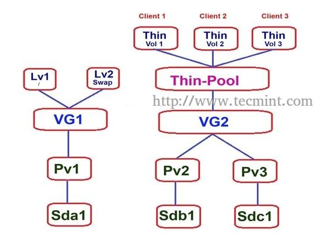

## LVM Migrating

* LVM là một tính năng của LVM cho phép tạo ra một bản sao dữ liệu từ một Logical Volume này đến một ổ đĩa mới mà không làm mất dữ liệu hay xảy ra tình trạng downtime.

* User case: Khi có một ổ cứng cũ bị lỗi, bạn muốn thêm một ổ cứng mới gắn vào và di chuyển dữ liệu trên ổ cũ sang ổ này thì migrating là một lựa chọn tốt của LVM.


### Thực hành

Tạo một mirror volume với câu lệnh

	lvcreate -L 1G -m 1 -n lv-mirror vg-demo1
	
Lệnh này sẽ tạo ra một logical volume `lv-mirror` và một bản mirror của nó với tùy chọn `-m 1`

Tiếp theo tạo một thư mục để mount vào logical volume này và kiểm tra tính năng này:

	mkfs.ext4 /dev/vg-demo1/lv-mirror 
	mkdir demo2
	mount /dev/vg-demo1/lv-mirror demo2

Tạo một file trong thư mục mới tạo 

	cd demo2
	echo "Hello World." >> greet.txt

Kiểm tra thông tin về Logical Volume bằng lệnh sau:

```sh
$ lvs -a -o +devices
root@intern-meditech:~/demo2# lvs -a -o +devices
  LV                   VG                 Attr       LSize   Pool Origin Data%  Meta%  Move Log Cpy%Sync Convert Devices                                    
  root                 intern-meditech-vg -wi-ao----  19.02g                                                     /dev/sda5(0)                               
  swap_1               intern-meditech-vg -wi-ao---- 512.00m                                                     /dev/sda5(4869)                            
  lv-demo1             vg-demo1           -wi-ao----   1.00g                                                     /dev/sdb1(0)                               
  lv-mirror            vg-demo1           rwi-aor---   1.00g                                    100.00           lv-mirror_rimage_0(0),lv-mirror_rimage_1(0)
  [lv-mirror_rimage_0] vg-demo1           iwi-aor---   1.00g                                                     /dev/sdb1(257)                             
  [lv-mirror_rimage_1] vg-demo1           iwi-aor---   1.00g                                                     /dev/sdb2(1)                               
  [lv-mirror_rmeta_0]  vg-demo1           ewi-aor---   4.00m                                                     /dev/sdb1(256)                             
  [lv-mirror_rmeta_1]  vg-demo1           ewi-aor---   4.00m                                                     /dev/sdb2(0)  
 ```

Ta thấy được `lv-mirror` đang gắn với lv-mirror_rimage_0(0) và lv-mirror_rimage_1(0), mà lv-mirror_rimage_0(0) đang gắn với `/dev/sdb1`, lv-mirror_rimage_1(0) đang gắn với `/dev/sdb2`. Như vậy ta có thể thấy dữ liệu lưu trên Mirror Volume được lưu ở hai chỗ.

Nếu muốn xóa một bản đi, ta sử dụng lệnh sau:

	lvconvert -m 0 /dev/vg-demo1/lv-mirror /dev/sdb1

Kết quả:

```sh 
$ lvs -a -o +devices
  LV        VG                 Attr       LSize   Pool Origin Data%  Cpy%Sync Convert Devices        
  root      intern-meditech-vg -wi-ao----  19.02g                                     /dev/sda5(0)   
  swap_1    intern-meditech-vg -wi-ao---- 512.00m                                    /dev/sda5(4869)
  lv-demo1  vg-demo1           -wi-ao----   1.00g                                     /dev/sdb1(0)   
  lv-mirror vg-demo1           -wi-ao----   1.00g                                     /dev/sdb2(1) 
```

Kiểm tra lại nội dung file `greet.txt` lúc đầu đã tạo ta thấy không có gì thay đổi, dữ liệu vẫn còn nguyên.

## LVM Snapshot

### Snapshot LVM là gì?

Snapshot là một tính năng của LVM cho phép tạo một bản sao lưu của thời điểm hiện tại để backup cho sau này, ta có thể khôi phục lại thời điểm đã backup trước đó nếu cần.

### Thực hành

Ở đây, tôi sẽ tạo một bản snapshot cho Logical Volume `lv-demo1`. Sử dụng lệnh: 

	lvcreate -l 50 --snapshot -n lv-demo1-snapshot /dev/vg-demo1/lv-demo1

Kiểm tra bằng lệnh `lvs` sẽ có thể xem được bản snapshot mới được tạo.

Vì Snapshot LVM cũng là một Logical Volume nên có thể xóa, tăng giảm kích thước như Logical Volume. Ví dụ nếu muốn xóa snapshot đi:

	lvremove /dev/vg-demo1/lv_demo1-snapshot

Để phục hồi lại một snapshot, trước tiên cần unmount Logical Volume của của bản snapshot trước (không phải bản snapshot)

	umount -v /dev/vg-demo1/lv-demo1
	lvconvert --merge /dev/vg-demo1/lv-demo1-snapshot

## Thin Provisioning trong LVM

### Thin Provisioning là gì?

Thin Provisioning là một tính năng nữa của LVM, nó cho phép tạo ra những ổ đĩa ảo từ storage pool giúp tận dụng tối đa tài nguyên của ổ đĩa.

Ví dụ một storage pool có dung lượng là 15GB, cấp cho 3 người, mỗi người 5GB, tổng tất cả mới sử dụng hết 6GB, nếu có thêm một user nữa thì sẽ không thể cấp phát mặc dù còn rất nhiều dung lượng trống (Thick volume). Để giải quyết vấn đề đó, ta có thể sử dụng Thin Provisioning. Khi đó bạn có thể cấp phát thêm cho user thứ 4 5GB để sử dụng. Cái này có nghĩa là dùng bao nhiêu cấp bấy nhiêu sẽ đỡ lãng phí tài nguyên hơn.

### Thực hành



Đầu tiên cần cài đặt gói:

	apt-get -y install thin-provisioning-tools

Tạo một Volume Group

	vgcreate -s 32M vg-thin /dev/sdc1

Tạo một LV thin pool với kích thước 6GB

	lvcreate -L 6G --thinpool thin-meditech vg-thin
	lvs

Tạo các Thin Volume

	lvcreate -V 2G --thin -n thin-si1 vg-thin/thin-meditech
	lvcreate -V 2G --thin -n thin-si2 vg-thin/thin-meditech
	lvcreate -V 2G --thin -n thin-si3 vg-thin/thin-meditech
	lvcreate -V 2G --thin -n thin-si4 vg-thin/thin-meditech

Tạo thư mục, format và mount để sử dụng

	mkdir /mnt/si{1..4}
	mkfs.ext3 /dev/vg-thin/thin-si1 && mkfs.ext3 /dev/vg-thin/thin-si2 && mkfs.ext3 /dev/vg-thin/thin-si3  mkfs.ext3 /dev/vg-thin/thin-si4
	mount /dev/vg-thin/thin-si1 /mnt/si1
	mount /dev/vg-thin/thin-si2 /mnt/si2
	mount /dev/vg-thin/thin-si3 /mnt/si3
	mount /dev/vg-thin/thin-si4 /mnt/si4

Tôi vừa tạo được 4 LV thin tổng 8G trên một pool chỉ có 6G mà vẫn được.