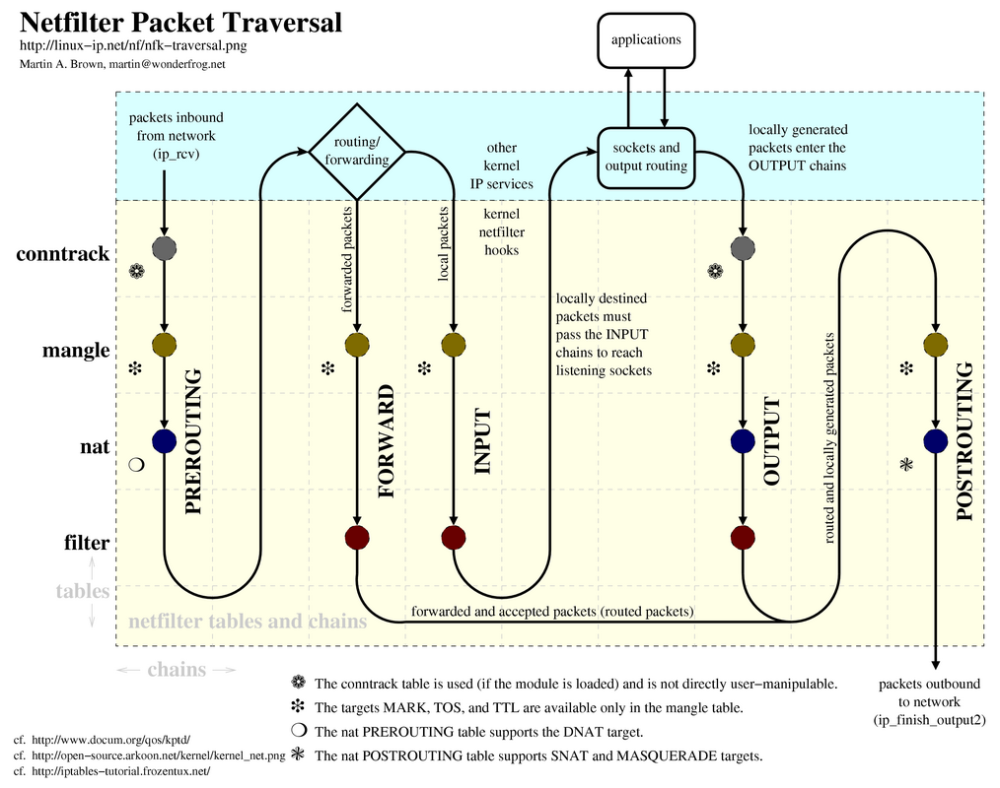

# IPTABLES 

1. [Tổng quan](#overview)
	* Iptables là gì? để làm gì?
	* Lịch sử phát triển
	* Các khái niệm

2. [Kiến trúc](#Arch)
	* Quá trình sử lý gói tin

3. [Iptables command](#ipcmd)
	* Các option command thông dụng

4. [Cài đặt iptables](#install)

5. [Use case](#usecase)

### [Tham Khảo](#thamkhao)


<a name="overview"></a>
## 1. Tổng quan

Iptables là firewall được cấu hình để lọc gói dữ liệu rất mạnh, miễn phí và có sẵn trên Linux. 

Tích hợp tốt với kernel của Linux. Có khả năng phân tích package hiệu quả. Lọc package dựa vào MAC và một số cờ hiệu trong TCP Header. Cung cấp chi tiết các tùy chọn để ghi nhận sự kiện hệ thống. Cung cấp kỹ thuật NAT. Có khả năng ngăn chặn một số cơ chế tấn công theo kiểu DoS.

Gồm 2 phần là Netfilter ở trong nhân linux và iptables nằm ngoài nhân. Iptables làm nhiệm vụ giao tiếp giữa người dùng và Netfilter để đẩy các luật từ người dùng vào cho netfilter xử lý. Netfilter làm việc trong kernel nhanh mà không ảnh hưởng đến tốc độ hệ thống.


<a name="Arch"></a>
## 2. Kiến trúc
### 2.1 Các khái niệm cơ bản
Iptables cơ bản gồm 3 thành phần chính: Table, chain, target

* Table 

Các table được sử dụng để định nghĩa các các rules cụ thể cho các gói tin. Có 4 loại table khác nhau: 

|Name|Định nghĩa |
|----|---|
|Filter table|Quyết định gói tin có được gửi tới đích hay không|
|Mangle table|Bảng quyết định việc sửa head của gói tin (các giá trị của các trường TTL, MTU, Type of Service)|
|Nat table|Cho phép route các gói tin đến các host khác nhau trong mạng NAT, cách đổi IP nguồn IP đích của gói tin. |
|Raw table| Một gói tin có thể thuộc một kết nối mới hoặc cũng có thể là của 1 một kết nối đã tồn tại. Table raw cho phép bạn làm việc với gói tin trước khi kernel kiểm tra trạng thái gói tin.|

* Chain

Mỗi table được tạo ra mới một số chain nhất định, Chain cho phép lọc gói tin tại các "hook points" khác nhau. Netfilter định nghĩa ra 5 "hook points" trong quá trình xử lý gói tin của kernel: PREROUTING, INPUT, FORWARD, POSTROUTING, OUTPUT.

Các build-int chains được gán vào các hook point và có thể add một loạt các rules cho mỗi hook points.

Chains không chỉ nằm trên một table và một table không chỉ chứa một chain.

|Hook points| Cho phép xử lý các packet...|
|----|----|
|PREROUTING| vừa mới tiến vào từ network interface. Nó sẽ được thực thi trước khi quá trình routing diễn ra, thường dùng cho DNAT (destination NAT)|
|INPUT| có địa chỉ đích đến là server của bạn|
|FORWARD| có đích là một server khác nhưng không được tạo từ server của bạn. Chain này là cách cwo bản để cấu hình server của bạn để route các request tới một thiết bị khác.|
|OUTPUT| được tạo bởi server của bạn|
|POSTROUTING| đi ra ngoài hoặc được forward sau khi quá trình routing hoàn tất, chỉ trước khi nó tiến vào đường truyền, thường dùng cho SNAT (source NAT)|


* Target 

Target đơn giản là các hành động áp dụng cho các gói tin. Đối với những gói tin đúng theo rule mà chúng ta đặt ra thì các hành động (target) có thể thực hiện được đó là:

+ Accept: Chấp nhận gói tin

+ Drop: loại bỏ gói tin, không có gói tin trả lời, phía nguồn sẽ không biết đích có tồn tại hay không.

+ Reject: loại bỏ gói tin nhưng có trả lời table gói tin khác, ví dụ trả lời table 1 gói tin "connection reset" đối với gói TCP hoặc bản tin “destination host unreachable” đối với gói UDP và ICMP.

+ Log: chấp nhận gói tin và ghi log lại

Khi có nhiều rule, gói tin sẽ đi qua tất cả các rule chứ không chỉ dừng lại khi đã đúng với một rule đầu. Đối với gói tin, không khớp với rule nào thì mặc định sẽ được chấp nhận.

* Bảng NAT

Bảng NAT có 3 chain được xây dựng sẵn trong table NAT là

+ Chain PREROUTING: Ví dụ đối với gói tin tcp có port đích là 80 thì sẽ được đổi địa chỉ đích thành 10.0.30.100: `iptables -t NAT -A PREROUTING -p tcp --dport 80 -j DNAT --to-destination 10.0.30.100:80`

+ Chain POSTROUTING: Ví dụ đổi địa chỉ nguồn với gói tin tcp thành 10.0.30.200: `iptables -t NAT -A POSTROUTING -p tcp -j SNAT --to-source 10.0.30.200`

+ Chain Output

* Bảng filter

Các chain được xây dựng sẵn trong bảng filter:

+ Chain Input

+ Chain Output 

+ Chain Forward

* Bảng Mangle 

Bảng này bao gồm tất cả các chain được xây dựng sẵn (5 chain)

### 2.2 Quá trình xử lý gói tin



Đầu tiên, khi gói tin đi vào từ mạng sẽ qua chain PREROUTING trước. Tại đây gói tin sẽ qua bảng mangle để thay đổi một số thông tin của header, sau đó đi tới bảng NAT để quyết định xem có thay đổi IP đích không (DNAT), tiếp theo sẽ đi vào bộ định tuyến routing để quyết định xem gói tin có được qua filewall không. Ở đây sẽ có 2 trường hợp:

* Nếu là local packets thì sẽ được đưa tới chain INPUT. Tại chain INPUT, packets sẽ đi qua bảng mangle và bảng filter để kiểm tra các chính sách (rule), ứng với mỗi rule cụ thể sẽ được áp dụng cho mỗi target, packet có thể được chấp nhận hoặc hủy bỏ. Tiếp theo packet sẽ được chuyển lên cho các ứng dụng (client/server) xử lí local và chuyển ra chain OUTPUT với các bảng mangle, nat, filter, gói tin có thể bị thay đổi các thông số, bị lọc hoặc bị hủy bỏ. 

* Nếu là forwarded packets, gói tin sẽ đi tới chain FORWARD, qua table mangle và filter. Đây là chain được sử dụng rất nhiều để bảo vệ người dùng trong mạng LAN với người sử dụng internet, các gói tin phải thỏa mãn các rule mới được chuyển qua các card mạng với nhau.

Sau khi đi qua chain OUTPUT hoặc FORWARD, gói tin đi tiếp tới chain POSTROUTING (sau khi được định tuyến), tại chain này packets đi qua bảng mangle, nat có thể bị thay đổi ip nguồn (SNAT) hoặc Masquerade trước khi đi ra ngoài mạng


<a name="ipcmd"></a>
## 3. Iptables command

#### Để xem các rule đang có trong iptables

	iptables -L -v

Trong đó: 

* TARGET: Hành động sẽ thực thi.
	* Accept: gói dữ liệu được chuyển tiếp để xử lý tại ứng dụng cuối hoặc hệ điều hành
	* Drop: gói dữ liệu bị chặn, loại bỏ
	* Reject: gói dữ liệu bị chặn, loại bỏ đồng thời gửi một thông báo lỗi tới người gửi
	* Log: Thông tin của nó sẽ được đưa vào syslog để kiểm tra. Iptables tiếp xúc xử lý gói tiin với quy luật kế tiếp. –log-prefix “string”: Iptables sẽ thêm vào log message một chuổi (string) do người dùng định sẳn. Thông thường để thông báo lý do vì sao gói bị loại bỏ
	* DNAT: Dùng để thực hiện thay đổi địa chỉ đích của gói dữ liệu. –to-destination ipaddress iptables sẽ viết lại địa chỉ ipaddress vào địa chỉ đích của gói tin,
	* SNAT: Thay đổi địa chỉ nguồn của gói dữ liệu.
	* MASQUERADE: Dùng để thay đổi địa chỉ ip nguồn. Mặc định thì địa chỉ ip nguồn sẽ giống với ip của firewall.
* PROT: Là viết tắt của chữ Protocol, nghĩa là giao thức. Tức là các giao thức sẽ được áp dụng để thực thi quy tắc này. Ở đây chúng ta có 3 lựa chọn là all, tcp hoặc udp. Các ứng dụng như SSH, FTP, sFTP,..đều sử dụng giao thức kiểu TCP.
* IN: chỉ ra rule sẽ áp dụng cho các gói tin đi vào từ interface nào, chẳng hạn như lo, eth0, eth1 hoặc any là áp dụng cho tất cả interface.
* OUT: Tương tự như IN, chỉ ra rule sẽ áp dụng cho các gói tin đi ra từ interface nào.
* DESTINATION: Địa chỉ của lượt truy cập được phép áp dụng quy tắc.

Ví dụ:

	ACCEPT    all    --   lo   any   anywhere   anywhere

Nghĩa là chấp nhận toàn bộ gói tin từ interface lo, lo ở đây nghĩa là “Loopback Interface“, chẳng hạn như IP 127.0.0.1 là kết nối qua thiết bị này.

	ACCEPT    all    --   any  any   anywhere   anywhere    ctstate  RELATED,ESTABLISHED

Chấp nhận toàn bộ gói tin của kết nối hiện tại. Nghĩa là khi bạn đang ở trong SSH và sửa đổi lại Firewall, nó sẽ không đá bạn ra khỏi SSH nếu bạn không thỏa mãn quy tắc

	ACCEPT    tcp    --   any  any   anywhere   anywhere    tcp      dpt:http

Cho phép kết nối vào cổng 80, mặc định sẽ biểu diễn thành chữ http.

	ACCEPT    tcp    --   any  any   anywhere   anywhere    tcp      dpt:https

Cho phép kết nối vào cổng 443, mặc định nó sẽ biểu diễn thành chữ https.

	DROP      all    --   any  any   anywhere   anywhere

Loại bỏ tất cả các gói tin nếu không khớp với các rule ở trên

#### Tạo một rule mới
	
	iptables -A INPUT -i lo -j ACCEPT

Trong đó:

* -A INPUT: khai báo kiểu kết nối sẽ được áp dụng (A nghĩa là Append).

* -i lo: Khai báo thiết bị mạng được áp dụng (i nghĩa là Interface).

* -j ACCEPT: khai báo hành động sẽ được áp dụng cho quy tắc này (j nghĩa là Jump).

gõ `iptables -L -v` bạn sẽ thấy xuất hiện một rule mới.

Sau khi thêm mới hoặc thay đổi bất cứ gì thì cần lưu và khởi động lại service

	service iptables save
	service iptables restart

Tiếp tục bây giờ chúng ta thêm một rule mới để cho phép lưu lại các kết nối hiện tại để tránh hiện tượng tự block bạn ra khỏi máy chủ.

	iptables -A INPUT -m state --state ESTABLISHED,RELATED -j ACCEPT

Trong đó: 
* `-m conntrack`: Áp dụng cho các kết nối thuộc module tên là “Connection Tracking“. Module này sẽ có 4 kiểu kết nối là NEW, ESTABLISHED, RELATED và INVALID. Cụ thể là ở quy tắc này chúng ta sẽ sử dụng kiểu RELATED và ESTABLISHED để lọc các kết nối đang truy cập.
* `–ctstate RELATED,ESTABLISHED`: Khai báo loại kết nối được áp dụng của cái module Connection Tracking mà mình đã nói ở trên.


Ví dụ cho phép các cổng được truy cập từ bên ngoài vào qua giao thức tcp: SSH(22), HTTP(80), HTTPS(443)

	iptables -A INPUT -p tcp --dport 22 -j ACCEPT

Trong đó:

* `-p tcp`: Giao thức được áp dụng (tcp, udp, all)
* `--dport 22`: Cổng cho phép áp dụng. 22 là cho SSH

Cuối cùng chặn toàn bộ các kết nối truy cập từ bên ngoài vào nếu không thỏa mãn các rule trên. 

	iptables -A INPUT -j DROP

#### Thêm một rule mới

Nếu muốn chèn một rule mới vào một hàng nào đó, ví dụ hàng 2 thì thay tham số `-A` thành tham số `INSERT -I`

	iptables -I INPUT 2 -p tcp --dport 8080 -j ACCEPT

#### Xóa một rule

Để xóa 1 rule mà bạn đã tạo ra tại vị trí 4, ta sẽ sử dụng tham số -D

	iptables -D INPUT 4

Xóa toàn bộ các rule chứa hành động DROP có trong iptables:

	iptables -D INPUT -j DROP

Kiểm tra lại xem đã xóa thành công chưa

#### Chặn một ip

Nếu muốn chặn một ip 59.45.175.62 thì bạn cần thêm một rule mới vào INPUT chain của table filter, sử dụng lệnh sau:

	iptables -t filter -A INPUT -s 59.45.175.62 -j REJECT

Ngoài ra chúng ta cũng hoàn toàn có thể chặn cả dải địa chỉ IP với việc sử dụng CIDR.

	iptables -A INPUT -s 59.45.175.0/24 -j REJECT

Tương tự bạn có thể chặn traffic đi tới một IP hoặc 1 dải IP nào đó bằng cách sử dụng OUTPUT chain:

	iptables -A OUTPUT -d 31.13.78.35 -j DROP

### Một số các tùy chọn thường sử dụng

|Tùy chọn|	Ý nghĩa|
|--|--|
|-A chain rule	|Thêm Rule vào chain|
|-D [chain] [index]	|Xóa rule có chỉ số trong chain đã chọn|
|-E [chain][new chain]|	đổi tên cho chain|
|-F [chain]	|Xóa tất cả các rule trong chain đã chọn, nếu ko chọn chain mặc định sẽ xóa hết rule trong tất cả các chain|
|-L [chain]	|Hiển thị danh sách tất cả các rule trong chain, nếu ko chọn chain thì mặc định nó sẽ hiện hết chain trong một table|
|-P [chain][target]	|Áp dụng chính sách đối với chain.|
|-Z [chain]|	Xóa bộ đếm của chain đi|
|-N [name new chain]|	Tạo một chain mới|
|-j [target]|	dùng để chỉ rõ gói tin sau khi thoải mãn rule sẽ được nhảy đến taret để xử lý|
|-m [match]	|dùng để mở rộng rule đối với với một gói tin (*)|
|-t [table]	|dùng để chọn bảng. nếu bạn không chọn thì mặc định iptable sẽ chọn bảng filter|
|-p [protocol]	|chỉ ra gói tin thuộc loại nào: tcp, udp, icmp,...|


<a name="install"></a>
## 4. Install iptables

Iptable thường được cài mặc định trong các hệ điều hành linux

* CentOS: `yum install iptables`

* Ubuntu: `apt-get install iptables`

CentOS 7 sử dụng FirewallD làm tường lửa mặc định thay vì iptables, nên để sử dụng iptables thì cần tắt FirewallD đi và khởi động iptable lên: 

```sh 
systemctl mask firewalld
systemctl enable iptables
systemctl enable ip6tables
systemctl stop firewalld
systemctl start iptables
systemctl start ip6tables
```

Trên Ubuntu thì sử dụng ufw, nên cần tắt ufw đi để tránh xung đột, do ufw và iptable đều là tường lửa mặc định:

	ufw disable

Kiểm tra iptable đã được cài đặt chưa:

* Ubuntu: `iptables --version`

* CentOS:

		rpm -q iptables
		iptables --version

Để khởi chạy iptables cùng hệ thống

	chkconfig iptables on

Trên Ubuntu, Iptables là chuỗi lệnh không phải là 1 services nên bạn không thể start, stop hay restart. Một cách đơn giản để vô hiệu hóa là bạn xóa hết toàn bộ các quy tắc đã thiết lập bằng lệnh flush:

	iptables -F


### Lưu lại các thay đổi về iptables

Mặc định khi bạn reload lại máy thì các rule iptables sẽ mất, để lưu lại cần cài thêm iptables-persistent

	sudo apt-get install iptables-persistent
	sudo netfilter-persistent save
	sudo netfilter-persistent reload


<a name="usecase"></a>
## 5. Use case

### Bài toán: Thao tác với bảng

Tôi có 3 con máy ảo trên vmware 14 như sau: 

* Server:
	
		OS: ubuntu 16.04
		Số card mạng: 2 
			NAT: 192.168.60.134
			Hostonly: 192.168.88.100
		

* Client 1:

		OS: ubuntu 16.04
		Số card mạng: 1 (Hostonly)
		ip: 192.168.88.136

* Client 2:

		OS: ubuntu 16.04
		Số card mạng: 1(Hostonly)
		ip: 192.168.88.101

Iptables sẽ được cấu hình trên server sao cho:

* Client 1 có thể đi ra được internet, client 2 thì không
* Chỉ cho client 2 ssh tới server còn client 1 thì không

#### Thực hiện cho phép client 2 ssh tới server

Cho phép client 2 kết nối tới server qua port 22:

	iptables -t filter -A INPUT -p tcp --dport 22 -s 192.168.88.101 -j ACCEPT

Chặn mọi kết nối khác tới card mạng host only port 22

	iptables -A INPUT -i ens32 -p tcp --dport 22 -j REJECT

Hãy thử ssh tới server, ta sẽ thấy client 2 kết nối được, còn client 1 thì không (qua card host)

#### Cho phép Client 1 ra ngoài mạng

Đầu tiên, trên client 1 cần đặt default route tới server:

	ip route del default
	ip route add default via 192.168.88.100

Trên server gõ lệnh sau:

	sysctl net.ipv4.ip_forward=1

Hoặc sửa file `/etc/sysctl.conf` để không bị mất mỗi khi reboot.

	net.ipv4.ip_forward=1

Rồi refresh lại bằng lệnh

	sysctl -p

Cấu hình nat cho phép nat qua card mạng ens33 (card NAT để ra ngoài mạng), set up Masquerading

	iptables -t nat -A POSTROUTING -o ens33 -j MASQUERADE

Save lại

	sudo netfilter-persistent save
	sudo netfilter-persistent reload

Giờ Client 1 đã có thể ra ngoài mạng


<a name="thamkhao"></a>
## Tham khảo

https://www.linode.com/docs/security/firewalls/control-network-traffic-with-iptables/

https://www.howtoforge.com/nat_iptables

https://www.karlrupp.net/en/computer/nat_tutorial
