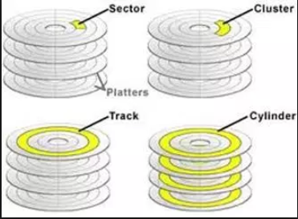

# Hard Disk

1. [Ổ cứng là gì?](#dinhnghia)
2. [Phân loại](#phanloai)
3. [Cấu tạo](#cautao)
4. [Tìm hiểu 3 tham số IOPS, Throughput và latency của ổ cứng](#timhieu)

## 1. Ổ cứng là gì?

Ổ cứng (Hard Disk Drive - HDD) là một thành phần quan trọng của máy tính, dùng để lưu trữ dữ liệu người dùng và của hệ thống và không bị mất dữ liệu khi cắt nguồn điện.

Ổ cứng đầu tiên trên thế giới ra đời năm 1955, sau đó liên tục được cải tiến, cho đến nay nó đã được phát triền với dung lượng và tốc độ ghi lớn hơn rất nhiều.

## 2. Phân loại

### 2.1 HDD

HDD là ổ cứng truyền thống. Nguyên lý làm việc cơ bản là có một đĩa tròn là bằng nhôm (hoặc thủy tinh, gốm) được phủ vật liệu từ tính. 

Giữa ổ đĩa có một động cơ quay để để đọc/ghi dữ liệu, kết hợp với những thiết bị này là những bo mạch điện tử nhằm điều khiển đầu đọc/ghi đúng vào vị trí của cái đĩa từ lúc nãy khi đang quay để giải mã thông tin. Vì vậy mà các thao tác của bạn như chép nhạc, phim hay dữ liều (Cài đặt phần mềm, game) nào đó từ máy tính ra thiết bị khác (USB, Ổ cứng) nhanh hay chậm cũng phụ thuộc vào phần này, hơn nữa chất liệu của các linh kiện trong ổ cứng này càng tốt thì dữ liệu bạn lưu trên này sẽ an toàn hơn.

HDD có tốc độ quay 5400 rpm hoặc cao hơn là 7200 rpm (số vòng quay càng cao thì ổ cứng hoạt động nhanh hơn đôi chút).

### 2.2 SSD

SSD à một loại ổ cứng thể rắn, được các chuyên gia về phần cứng nghiên cứu và chế tạo nhằm cạnh tranh với các ổ cứng HDD truyền thống, cải thiện về sức mạnh tốc độ, nhiệt độ, độ an toàn dữ liệu và cả về điện năng tiêu thụ. 

Nói cách khác ổ SSD là công nghệ phát triển sau này nên có phần vượt trội hơn HDD nhưng thời điềm hiện tại do giá thành vẫn còn quá cao nên các máy tính laptop vẫn sử dụng ổ HDD là chủ yếu.

Một số ưu điểm nổi bật của SSD so với HDD

* Thời gian khởi động hệ điều hành nhanh hơn
* Việc chép/xuất dữ liệu ra thiết bị khác nhanh hơn
* Hoạt động các phần mềm trên máy nhanh hơn
* Bảo vể dữ liệu cực tốt do có khả năng chống sốc cao cộng với được làm bằng linh kiện tốt nên bền hơn
* Băng thông truyền tải để đọc/ghi dữ liệu lớn vì vậy giúp tăng khả năng làm việc của máy tính

#### Chức năng sửa lỗi ECC

ECC (Error Correcting Code) là một chức năng giúp SSD có thể tự phát hiện và sửa các lỗi dữ liệu phát sinh trong quá trình sử dụng, giúp hạn chế tình trạng dữ liệu của chúng ta không may bị mất mát hoặc hư hỏng. Tuy nhiên ECC chỉ được trang bị trên những SSD cao cấp và do đó giá thành của chúng cũng đắt hơn SSD thông thường rất nhiều, tương tự thông số MLC/SLC và chuẩn Sata, ECC cũng được nhà sản xuất công bố và ghi rõ trên bao bì (cũng như trang web) của sản phẩm cho người sử dụng được biết.

### 2.3 Hybrid HD (Ổ cứng lai)

Hybrid HD là sản phẩm của sự kết hợp giữa ổ cứng dung lượng cao HDD và ổ cứng tốc độ truy xuất cao SSD. 

Hybrid HDD hoạt động theo nguyên tắc, khi người dùng sử dụng hệ thống sẽ kiểm tra những ứng dụng hay dữ liệu nào được sử dụng thường xuyên sẽ được lưu và ổ SSD, còn những ứng dụng, dữ liệu khác được lưu vào HDD. 

Ngắn gọn hơn thì HDD để lưu trữ dữ liệu và SSD để lưu các dữ liệu hay được sử dụng nhằm giúp CPU truy xuất nhanh hơn.

### 2.4 SSHD - Solid state hybrid drive (ổ cứng lại thể rắn)

Là ổ cứng được kết hợp giữa các phiến đĩa của HDD dùng để lưu trữ và những con chip NAND Flash giống SSD dùng để truy xuất dữ liệu. SSDH khác với Hybrid HDD ở chỗ dung lượng của những con chip NAND flash thường chỉ đạt 4 hoặc 8GB, trong khi HDD có thể có dung lượng SSD cao hơn (16 hoặc 32GB)

## 3. Cấu tạo HDD

Dữ liệu được lưu trữ trên đĩa, đĩa tròn đó được gọi là Platters. Trung tâm của đĩa có một động cơ quay là Spindle, để đọc/ghi dữ liệu các nhà sản xuất đã sử dụng các bộ điều khiển truyền động (Actuator) kết hợp với các tay truyền động (Actuator Arm) điều khiển đầu đọc nhỏ (Slider and Read/Write Head) và các cơ này được điều khiển bởi một bộ vi mạch nhỏ ở ngoài, chúng điều khiển đầu đọc ghi đúng vào vị trí trên các đĩa từ (platters) khi đĩa đang quay ở tốc độ cao, đồng thời giải mã các tính hiệu từ tính thành dữ liệu mà máy tính có thể hiểu được.

Cấu trúc dữ liệu của ổ cứng HDD được phân chia thành Track (rãnh từ), Sector (cung từ), Cluster (liên cung)

* Có thể có một hoặc nhiều đĩa
* Trên mặt đĩa có các đường tròn đồng tâm với các bán kính khác nhau gọi là **Track**
* Tập hợp các track cùng bán kính trên các đĩa được gọi là Cylinder. Khi bắt đầu đọc/ghi đầu tiên làm việc tại một track nào thì toàn bộ các track trên các bề mặt đĩa còn lại mà các đầu đọc còn lại đang làm việc tại đó gọi là cylinder
* Trên track chia thành những phần nhỏ bằng các đoạn hướng tâm thành các sector. Các sector là phần nhỏ cuối cùng được chia ra để chứa dữ liệu. Theo chuẩn thông thường thì một sector chứa dung lượng 512 byte.
* Trục quay: Trục quay là trục để gắn các đĩa từ lên nó, chúng được nối trực tiếp với động cơ quay đĩa cứng. Trục quay có nhiệm vụ truyền chuyển động quay từ động cơ đến các đĩa từ.
* Cluster (liên cung): là một đơn vị lưu trữ gồm một hoặc nhiều sectors. Khi lưu dữ liệu vào ổ cứng, các dữ liệu được ghi vào hàng chục, hoặc hàng trăm clusters liền kề hoặc không liền kề nhau. Nếu không có sẵn các cluster liền nhau, hệ điều hành sẽ tìm kiếm cluster còn trống ở gần và ghi tiếp dữ liệu lên đĩa. Quá trình cứ tiếp tục như vậy cho đến khi toàn bộ dữ liệu được lưu trữ hết.

## 4. Tìm hiểu 3 tham số IOPS, Throughput và latency của ổ cứng 

Throughput

Latency

IOPS
