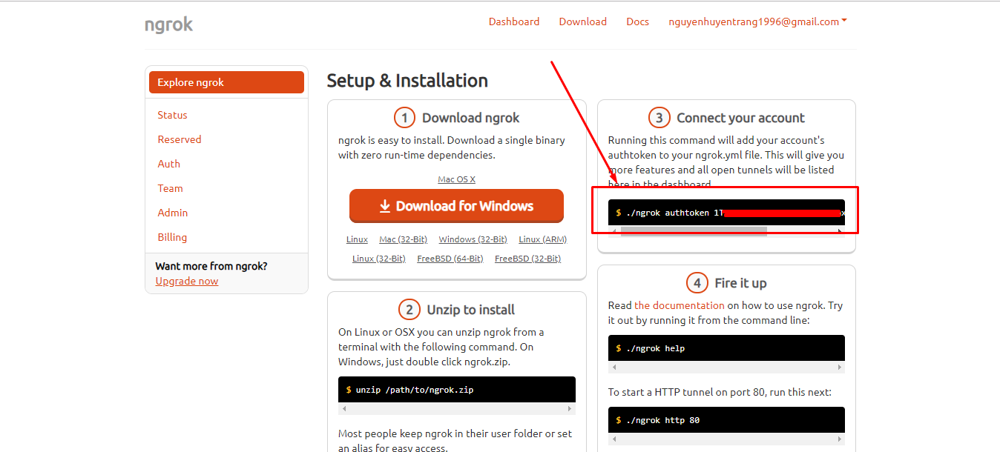
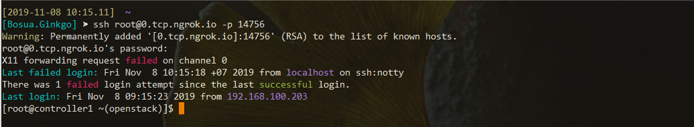

## Hướng dẫn sử dụng ngrok

### Cài đặt ban đầu

```sh
yum install -y wget unzip
wget https://bin.equinox.io/c/4VmDzA7iaHb/ngrok-stable-linux-amd64.zip
unzip ngrok-stable-linux-amd64.zip
./ngrok help
```

### Cài đặt httpd để phơi dịch vụ ra ngoài internet

* Cài đặt vào tạo một tunel để web-server có thể truy cập từ ngoài internet 

```sh
yum install -y httpd
systemctl start httpd
systemctl enable httpd
echo "<h1>Performed by trangnth</h1>" >> /var/www/html/index.html
./ngrok http 80
```

* Kết quả

```sh
ngrok by @inconshreveable                                                                                                (Ctrl+C to quit)

Session Status                online
Session Expires               7 hours, 59 minutes
Version                       2.3.35
Region                        United States (us)
Web Interface                 http://127.0.0.1:4040
Forwarding                    http://5d7c91ff.ngrok.io -> http://localhost:80
Forwarding                    https://5d7c91ff.ngrok.io -> http://localhost:80

Connections                   ttl     opn     rt1     rt5     p50     p90
                              0       0       0.00    0.00    0.00    0.00
```                            

* Truy cập vào link để kiểm tra `http://5d7c91ff.ngrok.io`


* Để thoát, nhấn CTRL + C để tắt trên terminal 

### Phơi dịch vụ ssh ra ngoài internet

* Đầu tiên cần login trên web tại đây: https://dashboard.ngrok.com/login

* Sau khi login thành công, copy dòng command sau để xác thực acount



* Kết quả

```sh
[root@controller1 ~(openstack)]$  ./ngrok authtoken 1TJd
Authtoken saved to configuration file: /root/.ngrok2/ngrok.yml
```

* Chạy lệnh sau trên terminal để export port của ssh service 

```sh
./ngrok tcp 22
```

* Kết quả 

```sh
ngrok by @inconshreveable                                                                                                (Ctrl+C to quit)

Session Status                online
Account                       Trang Nguyen (Plan: Free)
Version                       2.3.35
Region                        United States (us)
Web Interface                 http://127.0.0.1:4040
Forwarding                    tcp://0.tcp.ngrok.io:14756 -> localhost:22

Connections                   ttl     opn     rt1     rt5     p50     p90
                              0       0       0.00    0.00    0.00    0.00
```

* Thực hiện ssh từ xa theo dòng Forwarding được cấu hình bên trên

```sh
# Linux
ssh root@0.tcp.ngrok.io:14756

# Windows
ssh root@0.tcp.ngrok.io -p 14756
```


