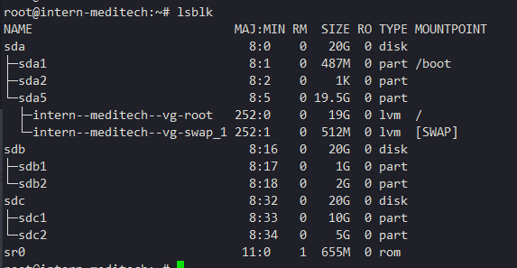
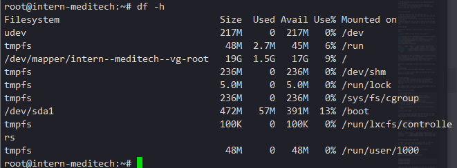
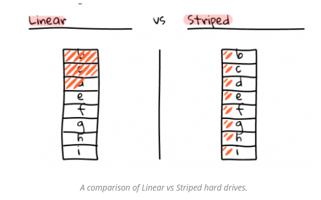

# Logical Volume Manager 
 
1. [Overview](#overview)
	
	* 1.1 [Khái niệm](#define)
	* 1.2 [Vai trò](#role)

2. [Architecture and component](#Arch&Comp)
	
	* 2.1 [Các thành phần](#comp)
	* 2.2 [Kiến trúc](#arch)

3. [Cơ chế hoạt động](#work_flow)

4. [Ưu Nhược điểm](#uunhuoc)
	
	* 4.1 [Ưu điểm](#uu)
	* 4.2 [Nhược](#nhuoc)

5. [Lab LVM](#lab)


<a name=overview></a>
## 1. Overview

<a name="define"></a>
### 1.1 Khái niệm

LVM (Logical Volume Manager) là một kỹ thuật cho phép tạo ra các không gian ổ đĩa ảo từ ổ đĩa cứng để có thể thay đổi kích thước dễ dàng hơn

<a name="role"></a>
### 1.2 Vai trò

LVM giúp nới rộng hoặc thu hẹp không gian ổ đĩa mà không cần phải chia lại partition trên đĩa cứng, không ảnh hưởng đến hệ thống và các dịch vụ đang chạy.

LVM có thể gom nhiều ổ đĩa cứng thành một ổ ảo, giúp tăng kích thước lưu trữ.

<a name="Arch&Comp"></a>
## 2. Architecture and component

<a name="comp"></a>
### 2.1 Các thành phần

Bố cục cơ bản Logical Volume Manager layout (LVM) trông giống như sau:

* Physical Volume(s): Là những ổ cứng vật lý hoặc các partition trên nó như: /dev/sdb1, /dev/sdc1, /dev/sdd1, /dev/sdc1
* Volume Group(s): Có thể coi đây là ổ đĩa ảo, bao gồm nhiều các Physical Volume: fileserver
* Logical Volume(s): Có thể coi đây là các phân vùng ảo trên ổ đĩa ảo, có thể thay đổi kích thước tùy ý: /dev/fileserver/share, /dev/fileserver/backup, /dev/fileserver/media


<a name="arch"></a>
### 2.2 Kiến trúc

**Partitions** là các phân vùng của Hard drives, mỗi Hard drives có 4 partition, trong đó partition bao gồm 2 loại là primary partition và extended partition

* Primary partition: là phân vùng chính, có thể khởi động, mỗi đĩa cứng có thể có tối đa 4 phân vùng này
* Extended partition: Phân vùng mở rộng, có thể tạo ra những vùng luân lý

**Physical Volume**: Là một cách gọi khác của partition trong kỹ thuật LVM, nó là những thành phần cơ bản được sử dụng bởi LVM. Một Physical Volume không thể mở rộng ra ngoài phạm vi một ổ đĩa.

**Logical Volume Group**: Nhiều Physical Volume trên những ổ đĩa khác nhau được kết hợp lại thành một Logical Volume Group, với LVM Logical Volume Group được xem như một ổ đĩa ảo.

**Logical Volumes**: Logical Volume Group được chia nhỏ thành nhiều Logical Volume, mỗi Logical Volume có ý nghĩa tương tự như partition. Nó được dùng cho các mount point và được format với những định dạng khác nhau như ext2, ext3 … Khi dung lượng của Logical Volume được sử dụng hết ta có thể đưa thêm ổ đĩa mới bổ sung cho Logical Volume Group và do đó tăng được dung lượng của Logical Volume.

**Physical Extent**: là một đại lượng thể hiện một khối dữ liệu dùng làm đơn vị tính dung lượng của Logical Volume

<a name=work_flow></a>
## 3. Cơ chế hoạt động

Bạn có một hoặc nhiều physical volumes trên nhiều disk, từ các physical volumes này, bạn có thể gom lại thành một hoặc nhiều các volume groups, mỗi volume group có thể chia là làm một hay nhiều các logical volumes. 

Nếu bạn sử dụng nhiều physical volume thì mỗi logical volume có thể lớn hơn một physical volume, nhưng tất nhiên tổng kích thước của logical volumes không thể vượt quá tổng kích thước của physical volumes.

LVM giúp bạn phân bổ không gian ổ đĩa hợp lý hơn, khi có bất kỳ phân vùng nào không dùng đến thì có thể dễ dàng ghép nó vào phân vùng đang cần mở rộng. Bạn có thể thay đổi kích thước bất cứ khi nào bạn cần.

Với LVM, một ổ ổ cứng, một tập các ổ cứng hay các partition khác nhau trên cùng một ở cứng được phân bổ cho một hay nhiều physical volume. Physical volume có thể được đặt trên các block devices khác, các mà có thể nằm trên nhiều disk. Các physical volume này sẽ kết hợp thành logical volume ngoại trừ partition `/boot`. 

`/boot` không thể nằm trong logical volume group được bởi vì boot loader không thể đọc nó. Nếu partition `root` nằm trên logical volume thì hãy tạo một một partition riêng cho `/boot` mà không phải là một phần của volume group.

Bởi vì physical volume không thể mở rộng trên nhiều ổ driver nên để mở rộng nhiều driver thì hãy tạo một hoặc nhiều physical volume trên một drive.

Volume group có thể chia làm các logical volume để làm các mount point như là `/home` và `root` và các loại file system như ext2 và ext3. Khi các partition full dung lượng, không gian trống trong volume group có thể được thêm vào logical volume để tăng dung lương cho partition. Khi có ổ cứng mới được lắp vào hệ thống, nó có thể được thêm vào volume group và tăng kích thước cho logical volumes.

<a name="uunhuoc"></a>
## 4. Ưu Nhược điểm 
<a name="uu"></a>
### 4.1 Ưu điểm

* Có thể gom nhiều đĩa cứng vật lý lại thành một đĩa ảo dung lượng lớn.
* Có thể tạo ra các vùng dung lượng lớn nhỏ tuỳ ý.
* Có thể thay đổi các vùng dung lượng đó dễ dàng, linh hoạt mà không cần format lại ổ đĩa.

<a name="nhuoc"></a>
### 4.2 Nhược điểm

* Các bước thiết lập phức tạp, khó khăn hơn.
* Càng gắn nhiều đĩa cứng và thiết lập càng nhiều LVM thì hệ thống khởi động càng lâu.
* Khả năng mất dữ liệu khi một trong số các đĩa cứng vật lý bị hỏng.
* Windows không thể nhận ra vùng dữ liệu của LVM. Nếu bạn Dual-boot Windows sẽ không thể truy cập dữ liệu chứa trong LVM.


<a name="lab"></a>
## 5. Lab LVM

Khi bạn gắn thêm một ổ cứng SCSI 20GB và thêm vào volume group

* Sử dụng `fdisk` để liệt kê các ở đĩa đang có
```sh
Disk /dev/sda: 20 GiB, 21474836480 bytes, 41943040 sectors
Units: sectors of 1 * 512 = 512 bytes
Sector size (logical/physical): 512 bytes / 512 bytes
I/O size (minimum/optimal): 512 bytes / 512 bytes
Disklabel type: dos
Disk identifier: 0xbda587d9

Device     Boot   Start      End  Sectors  Size Id Type
/dev/sda1  *       2048   999423   997376  487M 83 Linux
/dev/sda2       1001470 41940991 40939522 19.5G  5 Extended
/dev/sda5       1001472 41940991 40939520 19.5G 8e Linux LVM


Disk /dev/sdb: 20 GiB, 21474836480 bytes, 41943040 sectors
Units: sectors of 1 * 512 = 512 bytes
Sector size (logical/physical): 512 bytes / 512 bytes
I/O size (minimum/optimal): 512 bytes / 512 bytes
```

Dùng lệnh `ls /dev/sd*` để liệt kê các ổ đĩa bắt đầu bằng `sd`
```sh
$ ls /dev/sd*
/dev/sda  /dev/sda1  /dev/sda2  /dev/sda5  /dev/sdb
```
Ở đây, ta sẽ thấy có một ổ `sdb` mới được gắn vào và chưa nằm trong logical volume


### Tạo partition
Dùng lệnh `fdisk /dev/sdb` và gõ `m` để hiển thị trợ giúp. Để add thêm partition mới chọn `n`, để thêm partition extended chọn `e`, để thêm partition primary chọn `p`. 

Tại `First sector` bạn để mặc định, `Last sector` chọn +1G để partition tạo ra có dung lượng 1GB

Chọn `w` để lưu và thoạt
```sh
Command (m for help): n
Partition type
   p   primary (0 primary, 0 extended, 4 free)
   e   extended (container for logical partitions)
Select (default p): p
Partition number (1-4, default 1): 1
First sector (2048-41943039, default 2048): 
Last sector, +sectors or +size{K,M,G,T,P} (2048-41943039, default 41943039): +1G

Created a new partition 1 of type 'Linux' and of size 1 GiB.

Command (m for help): 
```

Tiếp theo bạn thay đổi định dạng partiton mới tạo thành LVM với lệnh `fdisk /dev/sdb`, chọn `t` để thay đổi định dạng partition và chọn `8e` để đổi thành LVM.

```sh
Command (m for help): t
Selected partition 1
Partition type (type L to list all types): 8e
Changed type of partition 'Linux' to 'Linux LVM'.
```

Chọn `p` để xem lại các phân vùng vừa tạo

```sh
Device     Boot   Start     End Sectors Size Id Type
/dev/sdb1          2048 2099199 2097152   1G 8e Linux LVM
/dev/sdb2       2099200 6293503 4194304   2G 8e Linux LVM
```

### Tạo Logical Volume trên LVM

Tương tự các bước trên tôi sẽ tạo ra một số phân vùng nữa (Như hình dưới). Dùng lệnh `lsblk` để kiểm tra.



Ở đây, disk `sdb` và `sdc` đều có 2 partition.

Tạo Physical Volume: Dùng lệnh `pvcreate` cho các partition

```
pvcreate /dev/sdb1
pvcreate /dev/sdb2
pvcreate /dev/sdc1
pvcreate /dev/sdc2
```

Dùng lệnh `pvs` hoặc `pvdisplay` để kiểm tra các Physical Volume.

Tạo Volume Group với tên vg-demo1

		vgcreate vg-demo1 /dev/sdb1 /dev/sdb2 /dev/sdc1 /dev/sdc2

Dùng lệnh `vgs` và `vgdisplay` để kiểm tra

### Tạo Logical Volume từ Volume group

Để tạo ra một Logical Volume tên là lv-demo1 có dung lượng là 1G trong group vg-demo1 sử dụng lệnh sau:

		lvcreate -L 1G -n lv-demo1 vg-demo1

Dùng lệnh `lvs` hoặc `lvdisplay` để kiểm tra.

Định dạng Logical Volume: Để format các Logic Volume thành các định dạng như ext2, ext3, ext4 ta làm như sau:

		mkfs -t ext4 /dev/vg-demo1/lv-demo1

Mount và sử dụng: Tạo một thư mục để mount Logical Volume đã tạo vào. Sau đó tiến hành mount logical volume. Lưu ý: đây là kiểu mount mềm, sẽ bị mất nếu máy khởi động lại. Để có thể sử dụng ngay cả khi reboot máy, bạn cần phải mount cứng.

```
mkdir demo1
mount /dev/vg-demo1/lv-demo1 demo1
```
Kiểm tra lại sử dụng `df -h`



### Thay đổi dung lượng LVM

Trước khi thay đổi dung lượng thì chúng ta nên kiểm tra lại một lần để xem trạng thái hiện tại có cho phép thay đổi không. `VG status` đang ở trạng thái `resizeable` cho phép thay đổi.

```sh
root@intern-meditech:~# vgdisplay
  --- Volume group ---
  VG Name               vg-demo1
  System ID             
  Format                lvm2
  Metadata Areas        4
  Metadata Sequence No  4
  VG Access             read/write
  VG Status             resizable
  MAX LV                0
  Cur LV                3
  Open LV               0
  Max PV                0
  Cur PV                4
  Act PV                4
  VG Size               17.98 GiB
  PE Size               4.00 MiB
  Total PE              4604
  Alloc PE / Size       3328 / 13.00 GiB
  Free  PE / Size       1276 / 4.98 GiB
  VG UUID               Zij5MI-DkQs-ZT44-eIdX-jomK-UdG8-11NcGf
```

* Để tằng kích thước Logical Volume thêm 50M ta dùng lệnh

		lvextend -L +50M /dev/vg-demo1/lv-demo1

* Sau khi tăng kích thước cho Logical Volume thì kích thước Logical Volume đã được tăng nhưng file system trên volume này vẫn chưa thay đổi, bạn phải sử dụng lệnh sau:

		resize2fs /dev/vg-demo1/lv-demo1

* Để giảm kích thước đầu tiên cần phải unmount trước

		mkdir /dump
		mv /root/demo1/* /dump/
		umount /root/demo1
		lvreduce -L 20M /dev/vg-demo1/lv-demo1
		mkfs.ext4 /dev/vg-demo1/lv-demo1


### Thay đổi dung lượng của Volume Group 

Khi muốn tăng kích thước của Volume Group, bạn cần có các partition sẵn sàng để thêm vào, sao đó dùng câu lệnh sau để thêm partition `/dev/sdb3` vào group:

	vgextend /dev/vg-demo1 /dev/sdb3

### Note adding the LV (Logical Volume) to the LVM VG (Volume Group)



**Linear** Là một hình thức ghi đĩa mặc định trên LVM, đọc ghi từng ổ đĩa Logical Volume một, đầy ổ này sang ổ tiếp theo. 

* Ưu điểm: Do lưu dữ liệu lần lượt lên từng ổ đĩa nên các ổ chưa sử dụng sẽ có tuổi thọ cao hơn, năng lượng dành cho việc ghi đĩa thấp hơn.
* Nhược điểm: Ghi từng ổ nên tốc độ ghi chỉ dừng ở maxspeed của ổ đĩa.

**Striped** Đọc/Ghi dữ liệu lên tất cả cá ổ đĩa cùng một lúc

* Ưu điểm: tốc độ đọc ghi cao hơn nhiều lần so với Linear.
* Nhược điểm: Khi muốn add thêm một ổ cứng, nếu ban đầu có 3 ổ thì cần add thêm 3 ổ nữa mới mở rộng được dung lượng của LV. Tuổi thọ của các ổ đĩa không cao bằng Linear. Và tiêu tốn nhiều năng lượng hơn.

Adding a linear LVM LV (Logical Volume)
	
	lvcreate -l 100%FREE -n {LV_NAME} {VG_NAME}

Alternately adding a stripped LVM LV (Logical Volume)

	lvcreate --extents 100%FREE --stripes {NUMBER_OF_PHYSICAL_DRIVES} --name {LV_NAME} {VG_NAME}