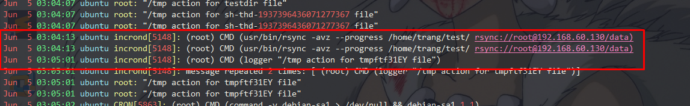

# Rsync ( Remote Sync)

1. [Overview](#overview)

2. [Install](#install)

3. [Config](#config)


<a name=overview></a>
## 1. Overview

Rsync là một công cụ cho phép truyền và đồng bộ file, thư mục từ xa giữa các máy tính một cách dễ dàng.

Với thuật toán delta-copy, Rsync chỉ copy những phần thay đổi, làm giảm được dữ liệu qua mạng, và nó có thể kiểm soát được băng thông cần thiết cho việc truyền tin.

Hoạt động trên Windowns, Mac OS và GNU/Linux.

### Một số các đặc điểm

* Mặc định rsync copy theo dạng block (nhưng vẫn có tùy chọn copy theo dạng file) nên tốc độ đồng bộ được cải thiện nhiều khi làm việc với file và thư mục có kích thước lớn.
* Rsync cho phép nén dữ liệu để giảm thiểu việc sử dụng băng thông. Nhưng nó cũng tốn thêm một khoảng thời gian cho việc nén và giải nén dữ liệu
* Mặc định sử dụng ssh trên hầu hết các hệ thống để mã hóa dữ liệu và bảo mật.
* Đặc biệt là Rsync copy và giữ nguyên các thông số về file và folder như: Symbolic links, Permissions, TimeStamp, Owner và Group.
* Không yêu cầu quyền super-user

### Các chế độ
Rsync có hai mode, một là remote-shell dùng lệnh copy bình thường (ssh, rsh), 2 là chạy daemon qua TCP. 

Mode daemon mặc định bind đến cổng 873, ở chế độ này, rsync hoạt động giống như một ftp server và cho phép download file public

## Cơ chế hoạt động
Rsync tìm kiếm files cần được transfer, sử dụng  lqquick checkrq algorithm (mặc định) để tìm các file có thay đổi về kích thước hoặc lần sử đổi cuối cùng (last-modified time). Bất kỳ một sự thay đổi nào về các thuộc tính thì sẽ được thực hiện trực tiếp luôn trên tệp đích khi kiểm tra sự thay đổi của dữ liệu file mà không cần phải update


<a name=install></a>
## 2. Install Rsync on Linux
Với Ubuntu/Debian: 

	apt-get install rsync

Với Red Hat/CentOS

	yum install rsync

### Sử dụng
Cấu trúc câu lệnh cơ bản

	rsync [options] source destination

Trong đó: 
	* Source(src): Đường dẫn tới dữ liệu nguồn
	* Destination(dest): Đường dẫn tới đích
	* Options: một số tùy chọn khác

**Local:** 
	
	rsync rsync [options] source [destination]

**Access via remote shell:** 

```
Pull: rsync [option] [user@]host:src [dest]
Push: rsync [option] src [user@]host:dest
```

**Access via rsync daemon:

```
Pull:   rsync [option] [user@]host::src [dest]
	rsync [option] rsync://[user@]host[:port]/src. [dest]
Push:   rsync [option] src [user@]host::dest
        rsync [option] src rsync://[user@]host[:port]/dest
```


### Các Option:
* `-v` mặc định rsync làm việc rất im lặng, với `-v` sẽ cho bạn thông tin về file đang được truyền và kết quả cuối cùng
* `-c` `--checksum` Tạo checksum trước khi gửi và kiểm tra sau khi nhận
* `-a` `--archive` Copy dữ liệu recursively và giữ nguyên được tất cả các thông số của file và thư mục
* `-r` Cũng là copy dữ liệu recursively nhưng không đảm bảo về các thông số trên
* `-z` nén dữ liệu trước khi truyền đi
* `--delete`: Xóa dữ liệu không liên quan ở Dest nếu Source không tồn tại dữ liệu đó
* `-u`: không ghi đè dữ liệu ở thư mục đích
* `--exclude`: trừ những dữ liệu không muốn truyền đi

### Ví dụ

#### 2.1 Copy file và thư mục trên local

	rsync -zvh backup.tar /tmp/backups/

#### 2.2 Copy file và thư mục giữa các server

Đẩy từ local lên server

	rsync -avz rpmpkgs/ root@192.168.0.101:/home/

Download từ server về local

	rsync -avzh root@192.168.0.100:/home/tarunika/rpmpkgs /tmp/myrpms

#### 2.3 Rsync qua ssh 

Download file từ Remote Server về Local Server 

	rsync -avzhe ssh root@192.168.0.100:/root/install.log /tmp/

Đẩy file lên Server 
	
	rsync -avzhe ssh backup.tar root@192.168.0.100:/backups/

#### 2.4 Sử dụng tùy chọn --include --exclude 
	
	rsync -avze ssh --include 'R*' --exclude '*' root@192.168.0.101:/var/lib/rpm/ /root/rpm


<a name=config></a>
## 3. Config 
Cấu hình đồng bộ giữa hai máy client và server

Client 
	
	ip: 192.168.60.134
	OS: Ubuntu 16.04

Server
	
	ip: 192.168.60.130
	OS: Ubuntu 16.04

Các bước cấu hình: 

### Cài đặt rsync trên cả client và server
	
	apt-get install xinetd rsync

### Cài đặt và cấu hình ban đầu
#### Trên server
* Sửa file `sudo vi /etc/default/rsync`, sử dùng như dòng dưới đây từ `false` thành `true`

	RSYNC_ENABLE=true


`/etc/init.d/rsync start`

* Tạo file `/etc/rsync.conf` với nội dung như sau

	
	lock file = /var/run/rsync.lock
	log file = /var/log/rsyncd.log
	pid file = /var/run/rsyncd.pid

	[data]
    	    path = /data
    	    uid = root
    	    gid = root
    	    read only = no
    	    hosts allow = 192.168.60.134/255.255.255.0

Lưu dữ liệu được đồng bộ từ client lên tại `/data`

* Chạy Rsync `/etc/init.d/rsync start`

#### Trên client

Test thử xem kết nối được tới server được chưa. Chạy lệnh với một số các tùy chọn sau: `rsync -avz --progress /home/trang/test/ rsync://root@192.168.60.130/data`

	root@ubuntu:/home/trang/test# rsync -avz --progress /home/trang/test/ rsync://root@192.168.60.130/data
	sending incremental file list
	./
	file2.txt
        	      0 100%    0.00kB/s    0:00:00 (xfr#1, to-chk=3/5)
	file3.txt
        	      0 100%    0.00kB/s    0:00:00 (xfr#2, to-chk=2/5)
	file/
	file/file4.txt
        	      0 100%    0.00kB/s    0:00:00 (xfr#3, to-chk=0/5)

	sent 270 bytes  received 88 bytes  716.00 bytes/sec
	total size is 0  speedup is 0.00
	
files và floder sẽ được đồng bộ trong /data của server

### Sử dụng `incrond` để check và đồng bộ real time

**Trên client **

* Cài incron

RHEL/Fedora/CentOS

	$ sudo yum install incron

Debian/Ubuntu

	$ sudo apt-get install incron


* Sửa file `/etc/incron.allow` thêm user root hoặc một user khác được phép sử dung incrond

	root
	trangnth

* `incrontab -e` thêm dòng sau

	/home/trang/test/ IN_CLOSE_WRITE,IN_CREATE,IN_DELETE rsync -avz --progress /home/trang/test/ rsync://root@192.168.60.130/data

Mỗi khi có sự thay đổi như thêm, xóa file, sửa file trong `/home/trang/test` sẽ được đồng bộ với server

* Xem log `vim /var/log/system`




