# Ubuntu server 16.04

1. [Overview](#overview)

2. [Phân vùng ổ cứng trong ubuntu](#partition)

3. [Install Ubuntu server 16.04](#install)

##1. Overview
### Linux
`Linux` là một hệ điều hành máy tính dựa trên Unix được phát triển và phân phối qua mô hình phần mềm tự do mã nguồn mở.
Chính xác thì `Linux` có nghĩa là nhân (kernel) của hệ điều hành, thành phần cốt lõi giúp một hệ thống điều hành các phần cứng. Và từ cái nhân này xây dựng lên các hệ điều hành khác, hệ điều hành này được gọi là các bản phân phối (distro) của linux. Do `Linux` mở nên bất cứ ai cũng có thể tạo một distro tùy ý cho mình.
Mỗi bản phân phối hướng đến một đối tượng, phục vụ một nhu cầu khác nhau. Các bản phân phối nổi tiếng hiện nay như: Ubuntu, Mint, Fedora, Arch, Suse,... Cơ bản đều dựa trên ba nhánh chính:
* Debian: Bản thân Debian cũng là một distro, trong nhánh này đều sử dụng phương thức quản lý gói là dpkg và phương thức cập nhật là apt. Tiêu biểu như: Ubuntu, Linux Mint Knoppix,... có sự thống nhất và ổn định cao hơn nhánh RedHat.

* RedHat: Phát triển dựa trên RedHat Linux Enterprise (RHEL). RHEL là một distro có tính chất thương mại và hướng tới người dùng doanh nghiệp, còn phiên bản chính thức của nó hướng tới người dùng cá nhân là Fedora. Ngoài ra còn một số các distro khác như: CentOS, Mandriva, OpenSUSE,... So với nhánh Debian, thì nhánh này ít có sự thống nhất hơn. mặc dù cùng sử dụng .rpm (vì vậy chúng còn có tên là các RPM distros) là đuôi tập tin cài đặt ứng dụng chính thức, các distros này sử dụng phương thức quản lí gói và cập nhật khá khác nhau.

* Slackware: Tiêu biểu như Arch, Gentoo,... là các distro được phát triển mà không dựa trên Debian hay RetHat, hầu hết việc sử dụng đều thông qua môi trường dòng lệnh.

Nổi tiếng và mạnh mẽ nhất hiện nay là Ubuntu và theo sau là Fedora. Fedora chỉ tập chung vào mã nguồn mở mà không có bất cứ một driver "đóng" nào, nếu cần thì đều phải tự tìm.
Ubuntu thì có giao diện thân thiện phù hợp cho người mới bắt đầu và kể cả những người có kinh nghiệm.

### Các phiên bản Ubuntu
Bản đầu tiên được phát hành vào ngày 20 tháng 10 năm 2004 là Ubuntu 4.10, các phiên bản mới được phát hành mỗi 6 tháng, đến nay có bản mới nhất là Ubuntu 18.04 phát hành vào tháng 4 năm 2018.
Gồm có các bản thông thường và các bản hỗ trợ lâu dài
Các phiên bản hỗ trợ dài hạn "Long Term Support", thường hỗ trợ 3 năm với máy đề bàn và 5 năm với server, các bản này sẽ ra mỗi 2 năm.

### Ubuntu Server
Ubuntu server được thiết kế riêng cho các mạng dịch vụ, chỉ có khả năng chạy như một file server đơn giản.
Không giống như Ubuntu Desktop, Ubuntu server không hỗ trợ các chương trình cài đặt đồ họa, thay vào đó là sử dụng các text menu-based.

## 2. Phân vùng ổ cứng trong Ubuntu

## 3. Install Ubuntu server 16.04
### Requirements
- Tối thiểu 2GB RAM
- Có cho phép truy cập vào DVD hoặc USB flash drive có chưa các phiên bản của Ubuntu Server 

### Install

* Đợi các quá trình khởi động ban đầu 

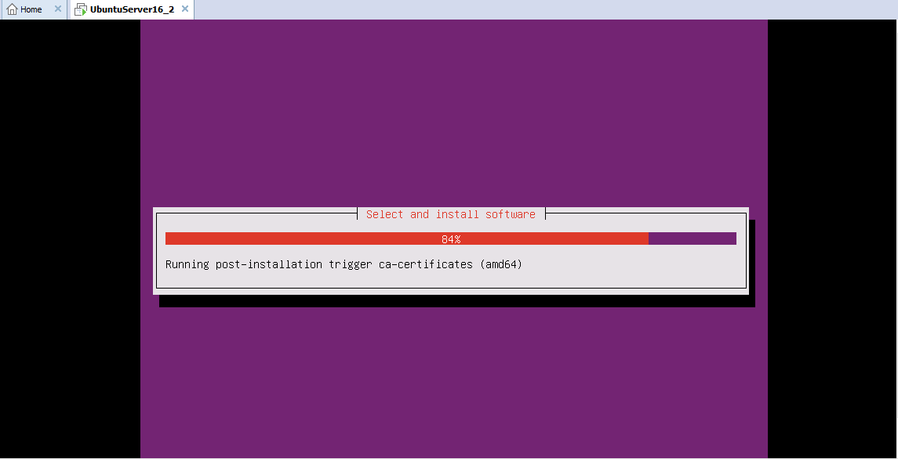

* Login với username và password đã tạo lúc cài máy ảo (đã hướng dẫn trong file VMWare.md)

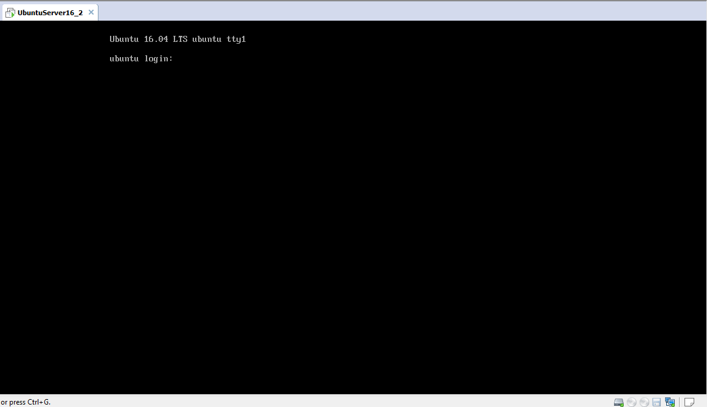

* Chọn ngôn ngữ

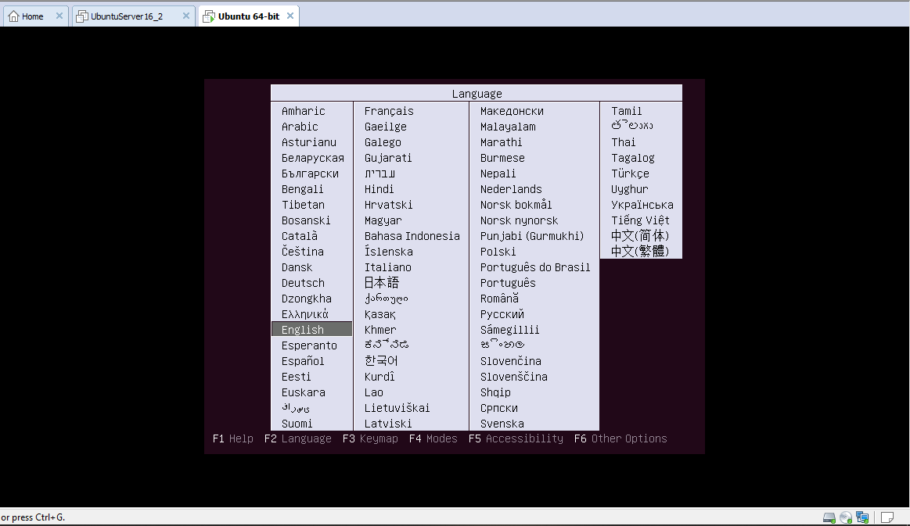

* Bắt đầu cài đặt

* Chọn ngôn ngữ cài đặt

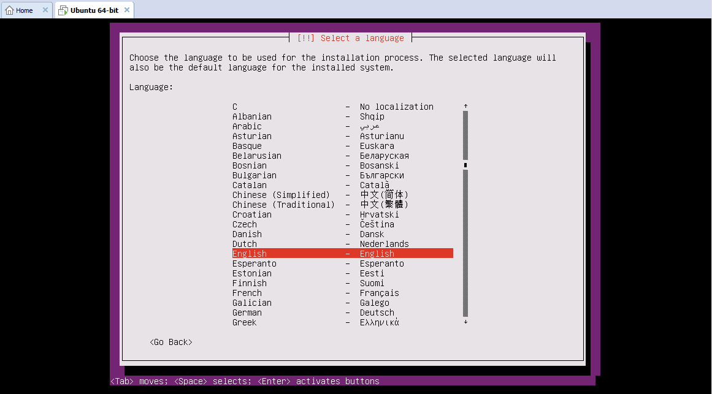

* Chọn location

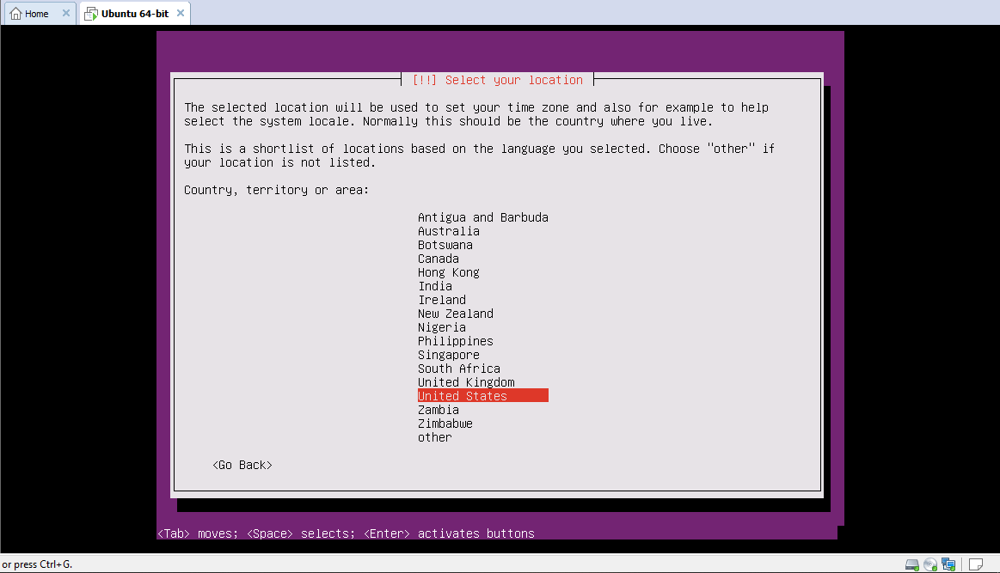

* Nếu không muốn dò và chọn bàn phím thủ công thì chọn `No` để chọn layout cho bàn phím ở bước tiếp theo

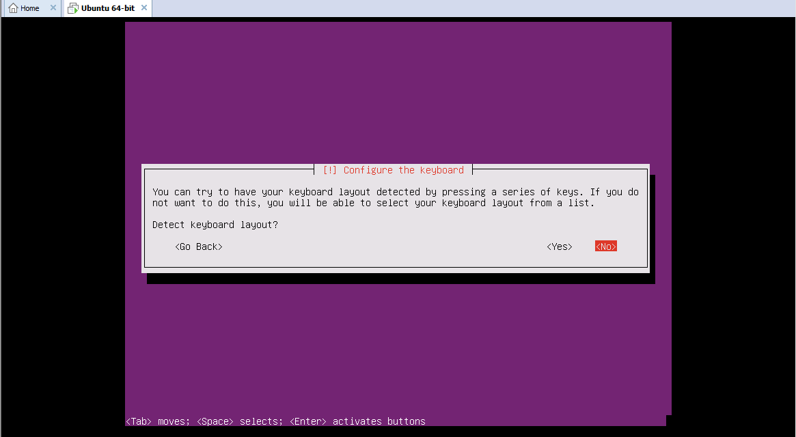

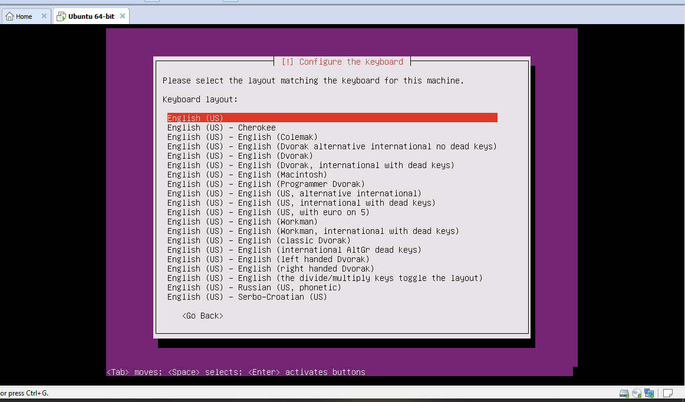

* Chờ một lúc để thiết lập dhcp, sau đó điền hostname vào và `next`

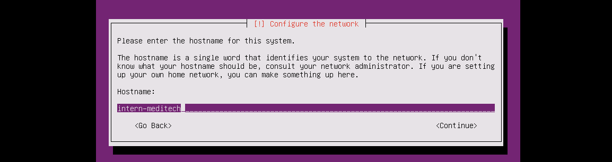

* Tạo một username và password cho riêng bạn, ở đây, Ubuntu không cho phép tạo ngay tài khoản root để tăng tính bảo mật

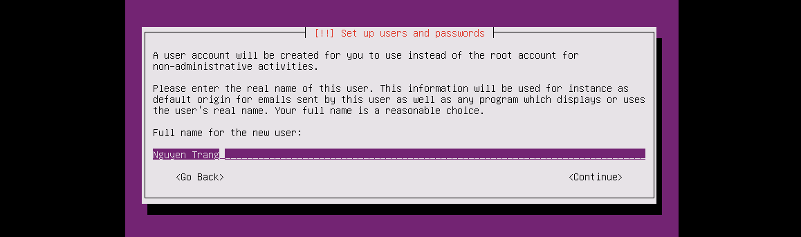

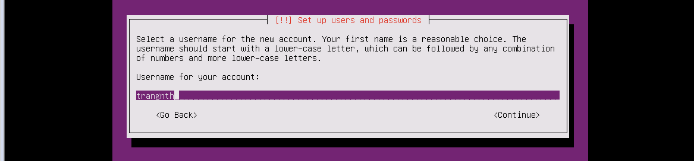

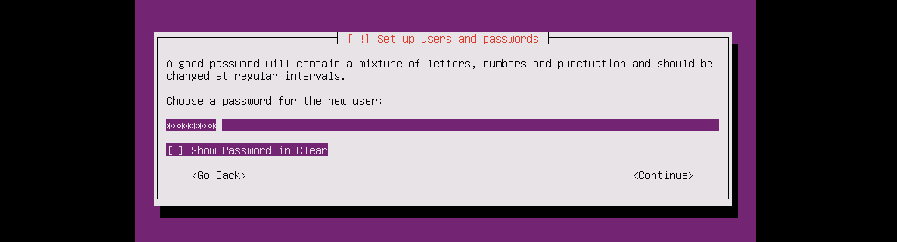

* Chọn `No` nếu không muốn mã hóa thư mục home

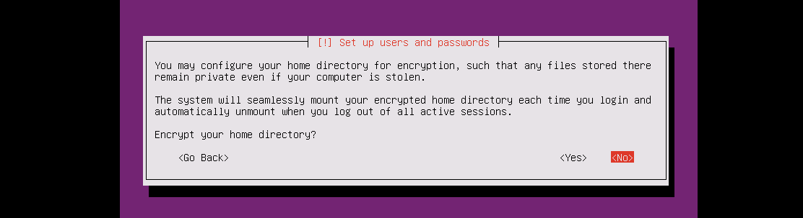

* Chọn timezone: đợi một lúc để máy tự xác nhận timezone dựa trên máy thật

Nếu đúng thì chọn `yes`, không đúng timezone trên thì chọn `No` để chọn timezone đúng

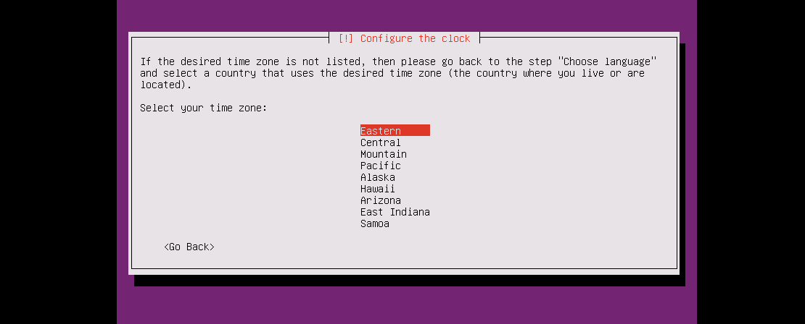

* Phân vùng ổ cứng cho Ubuntu
Ở đây có 4 sự lựa chọn
	* Guided - use entire disk: Sử dụng cho ổ cứng chưa từng được phân vùng, máy tính sẽ tự động format lại toàn bộ ổ cứng và định dạng cho từng vùng đã chia.
	* Guided - use entire disk and with set up LVM: Tự động phân vùng bằng LVM, là một phương pháp cho phép ấn định không gian đĩa cứng thành những logical volume, khiến cho việc thay đổi kích thước các ổ đĩa dễ dàng hơn mà không phải sửa lại table của OS. Trong trường hợp bạn đã sử dụng hết phần bộ nhớ còn trống của partition và muốn mở rộng dung lượng thì LVM là một sự lựa chọn tốt.
	* Guided - use entire disk and with set encrypted up LVM: Giống với lựa chọn 2 nhưng sẽ cài đặt mã hóa ổ cứng để tăng tính bảo mật. 
	* Manual: phân vùng thủ công.
Nếu storage đã kết nối với server của bạn mà chưa được định dạng thì quá trình cài đặt sẽ phát hiện ra điều này và đưa ra cho bạn 4 sự lựa chọn, đơn giản nhất là chọn lựa chọn thứ 2.
Bất kỳ sự lựa chọn nào cũng đều phá hủy tất cả data hiện tại trên phân vùng đó, nhưng nếu muốn thay kích thước và tạo phân vùng mới thì có thể chọn `Manual`.	

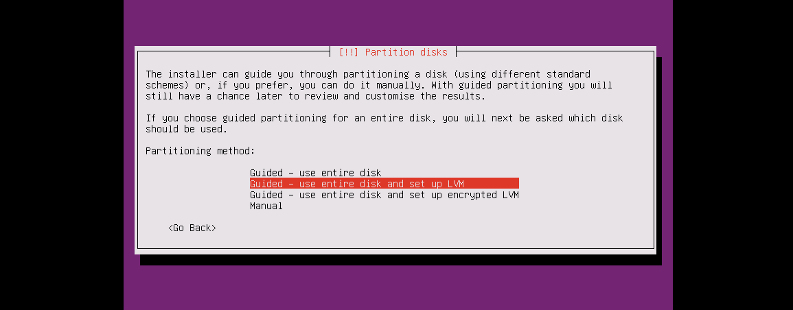

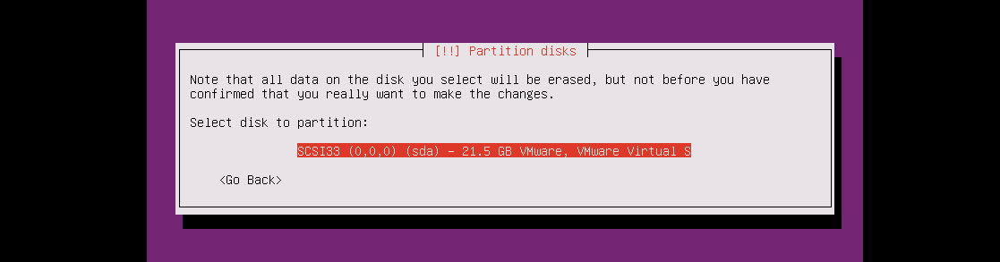

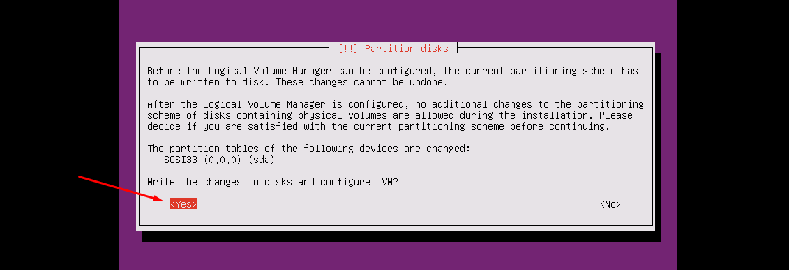

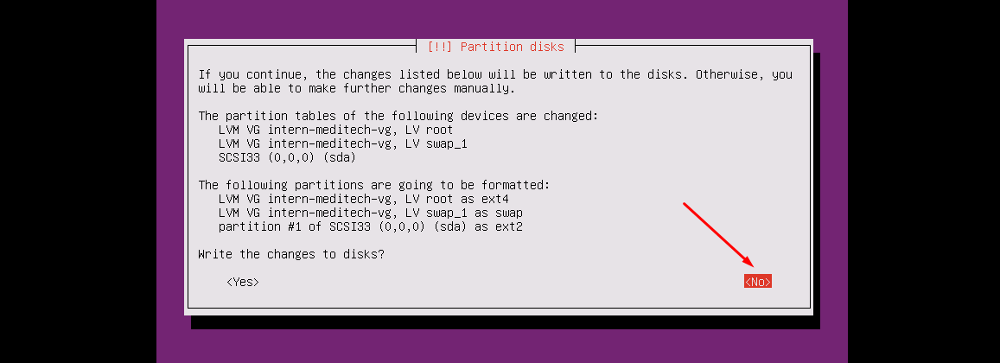

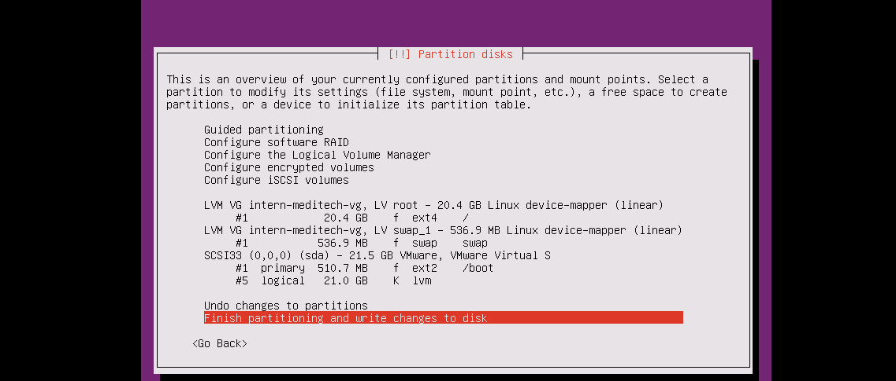

Nếu muốn sửa đổi thì chọn `Undo changes to partitions`

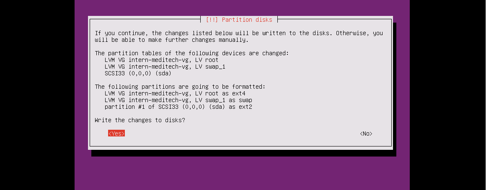

* Cấu hình proxy: có thể bỏ trống

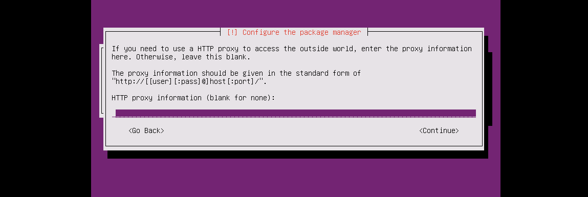

* Cấu hình update

Tùy từng đối tượng sử dụng mà có ba lựa chon: 
	+ `No automatic update`: Không tự động cập nhật
	+ `Install security updates automatically`: Cấu hình cho phép tự động cập nhật.
	+ `Mange system with Landscape`: Quản lý từ xa.

`Install security updates automatically` là sự lựa chọn an toàn nhất, nếu là doanh nghiệp để không ảnh hưởng tới băng thông toàn mạng, các máy agent nên chọn `Mange system with Landscape`

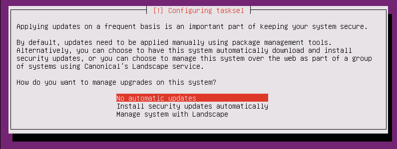

* Cài đặt các phần mềm hỗ trợ: sử dụng phím `space` để chọn
Mặc định sẽ chọn `standard system utilities` để cài các phần mềm cơ bản của ubuntu, ngoài ra bạn có thể cài thêm một số các dịch vụ khác hoặc có thể bỏ qua và sau này cài đặt sau. Ở đây là cài server nên có thể chọn thêm `OpenSSH server` để có thể ssh tới từ xa.

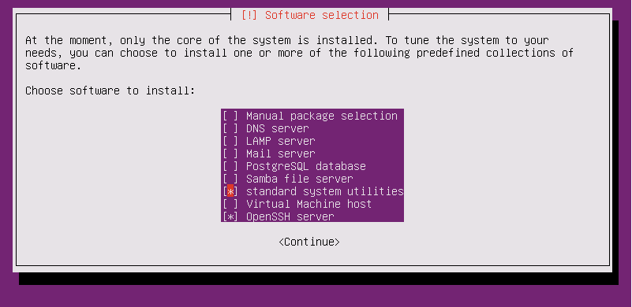

* Cài đặt GRUB boot loader trên hard disk

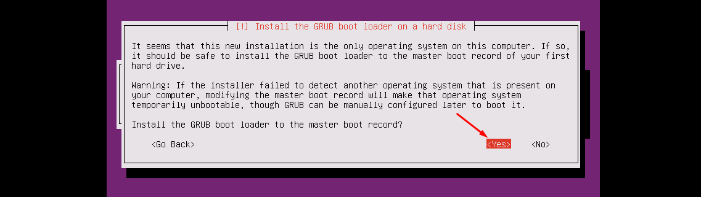

* Hoàn tất các cấu hình và đợi một lúc để khởi động lại hệ thống

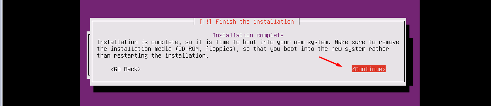

* Nhập username và password để login

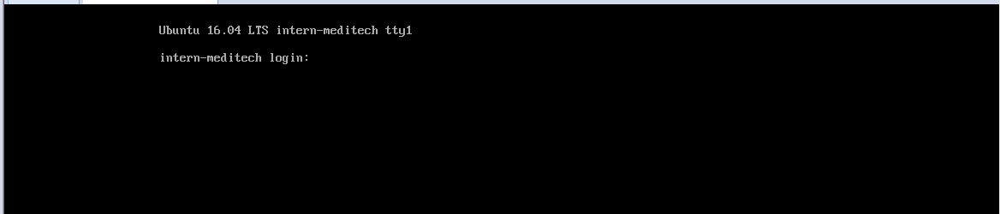