# VMWare Workstation

1. [Overview](#overview)

2. [Install VMWare](#install)

3. [Các chế độ card mạng của VMWare](#card)

4. [Tạo máy ảo](#cre)

## 1. Overview
- VMWare Workstation là một trong những phần mềm ảo hóa desktop mạnh mẽ nhất hiện nay, có giao diện thân thiện, dễ sử dụng, có nhiều tính năng tối ưu hóa bộ nhớ và khả năng quản lý các thiết lập nhiều lớp.
- Phần mềm cho phép người dùng có thể chạy nhiều hệ điều hành khác nhau như Windows, Linux, Fedora,... trên một máy tính mà không cần khởi động lại hay phân vùng lại ổ cứng, giúp cho việc học tập và nghiên cứu trở nên dễ dàng hơn.

### Các tính năng chính
- Cung cấp môi trường làm việc an toàn
- Kết nối với các Workstation servers khác để quản lý máy ảo
- Nâng cao tính bảo mật
- Test ứng dụng di động nhờ việc triển khai Android-x86
- Nâng cao hiệu năng nhờ tận dụng kiến trúc CPU mới

### Version mới nhất hiện nay là VMWare WorkStation 14.1.2
**Các tính năng mới**
* Hỗ trợ thêm các HĐH:
	* Ubuntu 17.04
	* Fedora 26
	* CentOS 7.4
	* RHEL 7.4
	* Debian 9.1
	* Oracle Linux 7.4
	* SLE 12 SP3
	* OpenSUSE 42.3
* Hỗ trợ Virtualization Based Security

Bảo mật dựa trên Ảo hóa trong Windows 10 đã chứng kiến sự chấp nhận đáng kể trong môi trường doanh nghiệp vì nó đã giúp tăng cường bảo mật chung của hệ điều hành Windows. Cả Workstation và Fusion Pro sẽ bổ sung thêm sự hỗ trợ rất cần thiết cho Virtualization Based Security (VBS) cho Windows 10 và Windows Server 2016. Các tính năng bảo mật của Windows 10 như Credential Guard, nền tảng an toàn khởi động của giao diện phần vững (UEFI) và đáng tin cậy với các module được bao gồm trong cả Fusion và Workstation Pro.

* Mạng ảo

Khi nói đến việc khắc phục sự cố và thử nghiệm các ứng dụng trên mạng, Bộ mô phỏng mới Latency Simulator sẽ là một bổ sung đáng hoan nghênh cho các công cụ mạng bao gồm trong Workstation Pro. Trong Fusion Pro, khả năng mô phỏng mất gói và giới hạn băng thông sẽ tăng cường các phương pháp của người dùng về kiểm tra các vấn đề về mạng. Một tính năng mạng tiên tiến khác là khả năng tùy chỉnh các tên bộ điều hợp NIC ảo, điều này sẽ giúp người dùng tổ chức tốt hơn các cấu hình mạng của họ.

* DevOps

Trong số các tính năng mới trong phiên bản Fusion này, VMware đã cho thấy khả năng nghe phản hồi của khách hàng vì nhiều người tập trung vào DevOps. Fusion bổ sung thêm các tính năng với Vagrant và Docker để giúp tự động hóa quá trình phát triển cho các ứng dụng chứa trong doanh nghiệp của bạn. Giờ đây, người dùng có thể sử dụng API REST dựa trên Swagger để tích hợp vào các kịch bản phát triển liên tục trong khi tận dụng quản lý kho của VM, sức mạnh, nhân bản và mạng.

* Đồ họa

Fusion Pro 10 sẽ không chỉ là một giao diện được cập nhật mới nhất mà còn sẽ cải thiện giao diện và chức năng cho người dùng cuối. Ngoài ra, Fusion sẽ bổ sung hỗ trợ máy ảo cho macOS 10.13 High Sierra. Người dùng sẽ thích rằng Fusion giờ đây thúc đẩy Mac TouchBar để dễ dàng và nhanh chóng kiểm soát môi trường của bạn.

* Và nhiều tính năng khác

## 2. Install VMWare
### Yêu cầu phần cứng
**OS:** Windows 64-bit

**RAM:** 4GB trở lên

*CPU:* Intel Core i3, Core i5 hoặc Core i7

*Disk:* nên sử dụng SDD để đem lại trải nghiệm Linux một cách mượt mà nhất, hoặc sử dụng ổ HDD cũng được

### Cài đặt 
* Download bản mới nhất cho Windows hoặc Linux [tại đây](https://www.vmware.com/products/workstation-pro/workstation-pro-evaluation.html). 

## 3. Các chế độ card mạng của VMWare
Sau khi cài đặt xong, VMWare sẽ tạo nên 2 card mạng VMware 1 và VMware 8 trên máy thật, máy thật sẽ sử dụng hai card này để kết nối với máy ảo.

Trong VMWare có ba chế độ card mạng như sau:
	- Bridge
	- NAT
	- Host-only
### Brige
* Card mạng của máy ảo sẽ được gắn trực tiếp với card mạng của máy thật (sử dụng switch ảo VMnet0). Lúc này, máy ảo sẽ đóng vai trò như một máy trong mạng thật, có thể nhận DHCP từ mạng ngoài, hoặc đặt IP tĩnh cùng dải với mạng ngoài để giao tiếp với các máy ngoài mạng hoặc lên Internet.

### NAT
* Lúc này máy ảo sẽ được cấu hình NAT và sử dụng IP của máy thật để giao tiếp với mạng ngoài.
* Các máy ảo được cấp địa chỉ IP nhờ một DHCP ảo của VMware. 
* Lúc này, các máy ảo sẽ kết nối với máy thật qua switch ảo VMnet8, và máy thật sẽ đóng vai trò NAT server cho các máy ảo.

### Host-only
* Khi cấu hình máy ảo sử dụng host-only networking, máy ảo sẽ được kết nối với máy thật trong một mạng riêng thông qua Switch ảo VMnet1 và không kết nối được ra mạng ngoài.
* Địa chỉ của máy ảo và máy thật trong mạng host-only có thể được cấp bởi DHCP ảo gắn liền với Switch ảo Vmnet1 hoặc có thể đặt địa chỉ IP tĩnh cùng dải để kết nối với nhau.

## 4. Tạo máy ảo trên VMWare
Việc cài đặt HĐH trên máy ảo hoàn toàn tương tự trên máy thật, giúp cho việc luyện tập cài đặt và sử dụng các hệ điều hành khác nhau mà không sợ sai sót ảnh hưởng đến máy thật.

* Giao diện của VMWare 

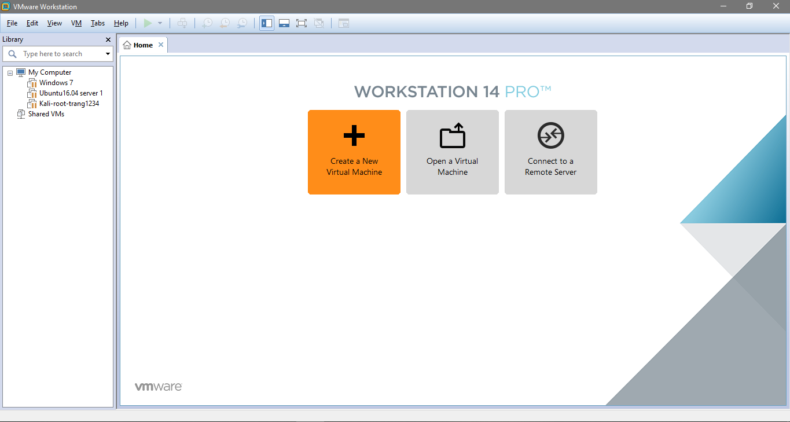

* Nhấn vào Create a New Virtual Machine

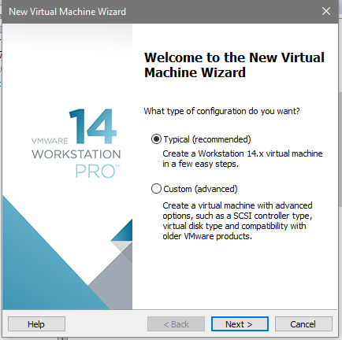

* Chọn `Typical` nếu muốn cài theo các thông số mặc định, `Custom` là tùy chỉnh tùy ý, để viết hướng dẫn, tôi sẽ chọn `Custom` và nhấn `Next`.

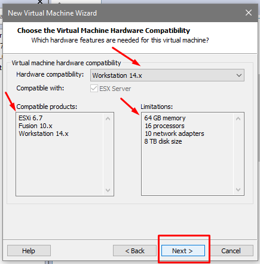

* Ở đây bạn có thể chọn một tùy chọn cho khả năng tương thích phần cứng của nó ở `Hardware compatibility` và nhìn thấy các sản phẩm tương thích hay các thông số giới hạn. Bấm `Next` để sang bước tiếp theo.

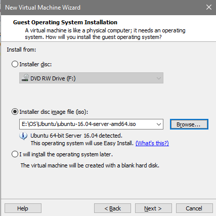

* Có 3 tùy chọn:
	* `Installer disc`: cài đặt từ ổ đĩa
	* Cài đặt từ file iso: Tôi dùng cách này, trước hết cần download bản iso của hệ điều hành sẽ cài về, lưu đâu đó rồi dẫn link vào đây.
	* Lựa chọn cuối cùng là sẽ cài đặt sau, lúc này máy ảo sẽ được tạo ra với ổ đĩa trống.
Chọn `Next` và điền thông tin

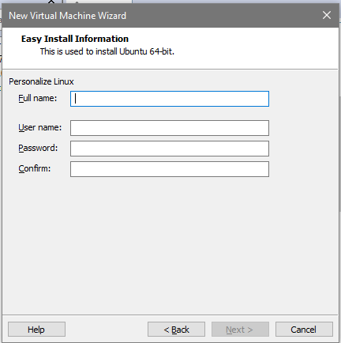

* Chọn tên và thêm vị trí lưu máy (nên để ngoài ổ C:\)

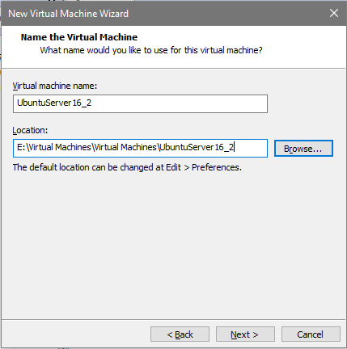

* Lựa chọn số nhân và số cores cho mỗi nhân

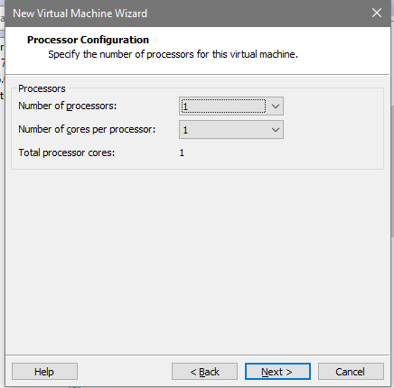

* Chọn kích thước RAM

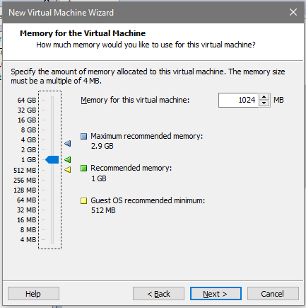

* Tiếp theo chọn card mạng phù hợp

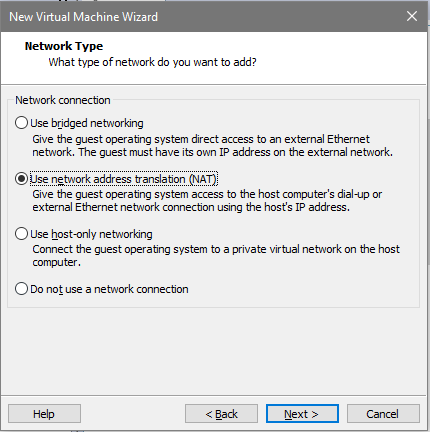

* I/O Controller Types

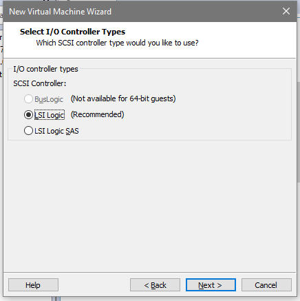

Tùy chọn đầu `BusLogic` không phù hợp cho hệ điều hành phân bản 64-bit. LSI Logic có giao diện song song và LSI Logic SAS thì có giao diện nối tiếp. LSI Logic đã được cải thiện hiệu suất và hoạt động tốt hơn so với các thiết bị SCSI chung. Mặc định sẽ chọn LSI Logic.

* Select a Disk Type

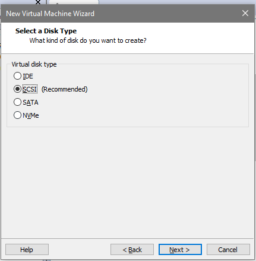
	* Có thể chọn `IDE` disk cho bất kỳ hệ thống nào
	* Có thể chọn `SCSI` disk cho bất kỳ hệ thống nào có driver cho LSI Logic hoặc BusLogic SCSI controller có sẵn trong máy ảo.
	* Có thể chọn `SATA` disk cho một vài hệ thống
	* Có thể chọn `NVMe` cho hệ thống support loại NVMe disk
ở đây tôi sẽ chọn mặc định

* Tiếp theo là lựa chọn ổ đĩa: Tạo một ổ mới, sử dụng một ổ đã tồn tại hoặc cho phép truy cập vào ổ đĩa thật. Tôi chọn tạo ổ mới sau đó ấn `Next`.

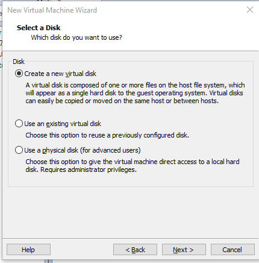

* Specify Disk Capacity: tùy chọn dung lượng tối đa cho ổ cứng phù hợp với máy ảo và máy thật

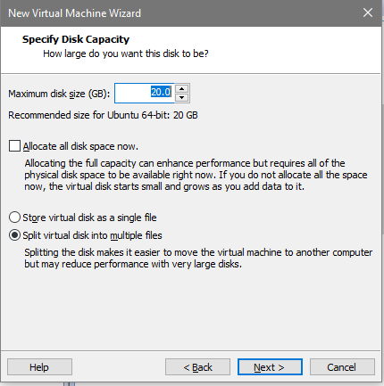

Hoặc có thể tích vào `Allocate all disk space now` để chọn sử dụng tất cả những dung lượng trống. Chọn chia ổ cứng làm nhiều file `Split virtual disk multiple files` hoặc lưu trong một file `Store virtual disk as a single file". Sau đó chọn nơi lưu ổ cứng

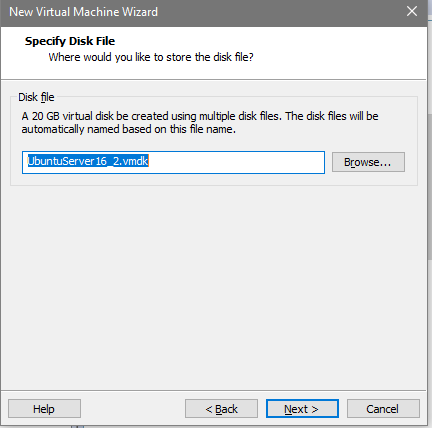

* Hoàn thành cài đặt

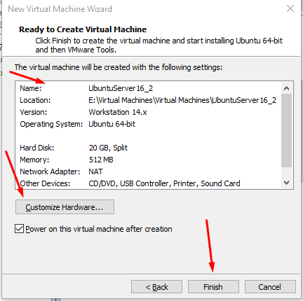

Xem lại các thông số, nếu có sai sót gì nhấn `Back` hoặc `Customize Hardware` để tùy chỉnh. Click chọn `Power on this vitual machine after creation` để khỏi chạy máy ảo luôn sau khi cài đặt xong, và cuối cùng nhấn `Finish` để hoàn tất.

Máy đang chạy

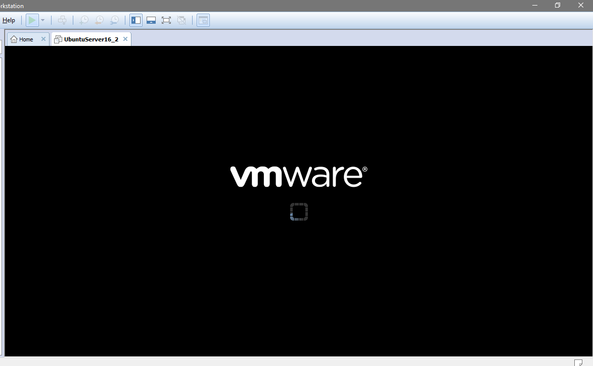

**Tiếp theo về phần cài đặt lên ubuntu 16 xem** [ở đây](ubuntu16.04.md)

