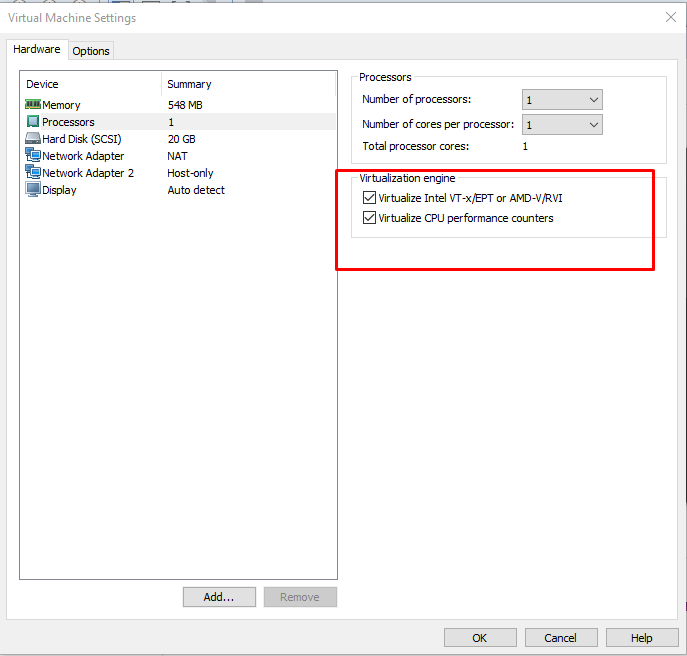

## Cài đặt KVM

1. [Mô hình](#mohinh)
2. [Cài đặt KVM](#install)


<a name="mohinh"></a>
### 1. Mô hình
Ở đây, tôi dùng VMWare để tạo nên một máy ảo với các thông số sau:

	Ubuntu 16.04 server 64bit
	2 card mạng:
		Nat: 192.168.60.134/24
		Hostonly: 192.168.99.129/24

Và sẽ cài KVM cấu hình card mạng trên con này. Dùng máy Windown 10 để ssh với MobaXterm (khuyến khích nên dùng phần mềm này)

Mô hình minh họa:


### 2. Cài đặt

Đầu tiên, kiểm tra xem CPU có hỗ trợ ảo hóa phần cứng Intel VT-x hoặc AMD-V hay không:

	egrep -c '(svm|vmx)' /proc/cpuinfo

Nếu trả về `0` là không hỗ trợ, khác `0` là có hỗ trợ. Nhưng nếu là `0` thì bạn vẫn có thể kích hoạt chức năng hỗ trợ ảo hóa phần cứng trog bios.

Nếu sử dụng VMWare thì cần bật chức năng ảo hóa Intel VT-x/EPT hoặc AMD-V/RVI trong Processors lên



Cài đặt KVM và một số gói liên quan:

	sudo apt-get update
	sudo apt-get install qemu-kvm libvirt-bin bridge-utils

Thêm tài khoản người dùng vào group `libvirtd`, vì chỉ có user root và các người dùng thuộc group này mới sử dụng được KVM.

	sudo adduser <username> libvirtd

Login lại, sau đó chạy lệnh sau:

```sh
trang@ubuntu:~$ virsh --connect qemu:///system list
 Id    Name                           State
----------------------------------------------------
trang@ubuntu:~$
```

Hiện thị như trên là đã ổn. Tiếp theo sẽ cấu hình [Linux Bridge](4. Timhieu_LinuxBridge.md).
