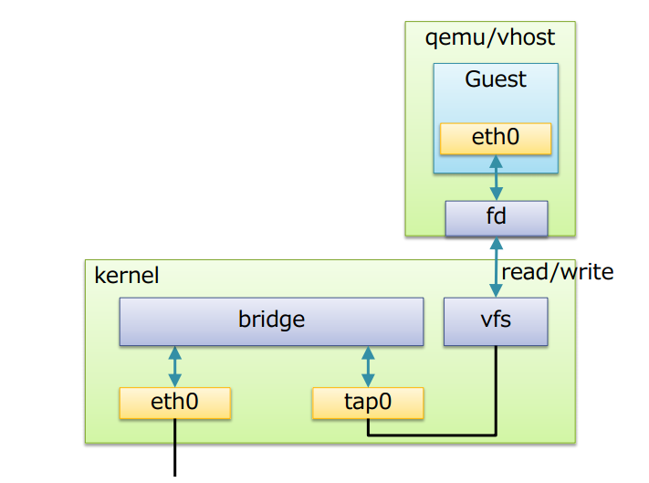

## Linux Bridge

1. [Khái niệm](#kn)
2. [Một số khái niệm khác](#knk)
3. [Cấu hình Linux Brige](#config)

<a name="kn"></a>
### 1. Khái niệm
Linux Brige là một phần mềm được tích hợp vào trong nhân Linux để giải quyết vấn đề ảo hóa phần network trong các máy vật lý. Về mặt logic Linux bridge sẽ tạo ra một con switch ảo để cho các VM kết nối được vào và có thể giao tiếp với nhau cũng như ra ngoài mạng



Trong đó:

* Port : tương tự như cổng của một con switch thật
* Bridge: tương đương với từ switch
* tap : là giao diện để các VM kết nối với bridge do linux bridge tạo ra
* FDB : Forwading database

Chức năng của một switch ảo do Linux bridge tạo ra

* STP: là tính năng chống loop gói tin trong switch

* VLan: là tính năng rất quan trọng trong một switch

* FDB: là tính năng chuyển gói tin theo database được xây dựng giúp tăng tốc độ của switch

<a name="knk"></a>
### 2. Các khái niệm khác

* Tap : có thể hiểu nó là một giao diên mạng để các máy ảo có thể giao tiếp được với bridge và nó nằm trong nhân kernel. Tap hoat động ở lớp 2 trong mô hình OSI

	* Ethernet port trên máy ảo VM (mô phỏng pNIC) thường gọi là vNIC (Virtual NIC). Virtual port được mô phỏng với sự hỗ trợ của KVM/QEMU.

	* Port trên máy ảo VM chỉ có thể xử lý các frame Ethernet. Trong môi trường thực tế (không ảo hóa) interface NIC vật lý sẽ nhận và xử lý các khung Ethernet. Nó sẽ bóc lớp header và chuyển tiếp payload (thường là gói tin IP) tới lên cho hệ điều hành. Tuy nhiên, với môi trường ảo hóa, nó sẽ không làm việc vì các virtual NIC sẽ mong đợi các khung Ethernet.

	* Tap interface là một khái niệm về phần mềm được sử dụng để nói với Linux bridge là chuyến tiếp frame Ethernet vào nó. Hay nói cách khác, máy ảo kết nối tới tap interface sẽ có thể nhận được các khung frame Ethernet thô. Và do đó, máy ảo VM có thể tiếp tục được mô phỏng như là một máy vật lý ở trong mạng.

	* Nói chung, tap interface là một port trên switch dùng để kết nối với các máy ảo VM.

* fd (forward data): dùng để chuyển tiếp data từ máy ảo

* Port:

	* Trong networking, khái niệm port đại diện cho điểm vào ra của dữ liệu trên máy tính hoặc các thiết bị mạng. Port có thể là khái niệm phần mềm hoặc phần cứng. Software port là khái niệm tồn tại trong hệ điều hành. Chúng thường là các điểm vào ra cho các lưu lượng của ứng dụng. Tức là khái niệm port mức logic. Ví dụ: port 80 trên server liên kết với Web server và truyền các lưu lượng HTTP.

	* Hardware port (port khái niệm phần cứng): là các điểm kết nối lưu lượng ở mức khái niệm vật lý trên các thiết bị mạng như switch, router, máy tính, … ví dụ: router với cổng kết nối RJ45 (L2/Ethernet) kết nối tới máy tính của bạn.

	* Physical switch port: Thông thường chúng ta hay sử dụng các switch L2/ethernet với các cổng RJ45. Một đầu connector RJ45 kết nối port trên switch tới các port trên NIC của máy tính.

	* Virtual switch port: giống như các physical switch port mà tổn tại như một phần mềm trên switch ảo. cả virtual NIC và virtual port đều duy trì bởi phần mềm, được kết nối với nhau thông qua virtual cable.

<a name="config"></a>
### 3. Cấu hình Linux Brige

Sau khi cài [KVM](https://github.com/trangnth/Report_Intern/blob/master/ghichep-kvm/3.%20Caidat_KVM.md)

Tạo một bridge có tên `br0`

	sudo brctl addbr br0

Gán nó với card mạng thật `ens33`

	sudo brctl addif br0 ens33

Nếu cần thiết thì có thể enable STP 

	brctl stp br1 on

Khi tạo một switch mới là `br0`, trên host sẽ xuất hiện thêm một NIC ảo cung tên với switch đó là `br0`. Ta có thể cấu hình cho NIC này trong file `/etc/network/interface`

Cấu hình file `/etc/network/interface` cho card mạng mới tạo này như sau:

```sh
# This file describes the network interfaces available on your system
# and how to activate them. For more information, see interfaces(5).

source /etc/network/interfaces.d/*

# The loopback network interface
auto lo
iface lo inet loopback

# The primary network interface
auto ens32
iface ens32 inet dhcp

#auto ens33
iface ens33 inet manual

auto br0
iface br0 inet dhcp
bridge_ports ens33
bridge_stp off
bridge_fd 0
bridge_maxwait 0
```

Một số tùy chọn:

* bridge_ports none: nếu bạn không muốn gán bất cứ port nào vào bridge
* bridge_stp off: tắt chế độ STP (Spanning Tree Protocol)
* bridge_fd 0: không delay forwarding

Lưu ý: nhớ comment dòng `auto ens33` đi và để `iface ens33 inet manual` hoặc cũng có thể comment đi cũng đc

Khởi động lại card mạng

	sudo ifdown -a && sudo ifup -a

Kiểm tra lại bridge

```sh
trang@ubuntu:~$ sudo brctl show
bridge name     bridge id               STP enabled     interfaces
br0             8000.000c29b20468       no              ens33
virbr0          8000.52540056f3ed       yes             virbr0-nic
```

Nếu muốn ngắt card mạng ens33 ra khỏi br0

	brctl delif br0 ens33

#### Nếu muốn gán 2 port ens32 và ens33 vào cùng một brige là br0 

Gán hai card mạng vào bridge br0

	sudo brctl addif br0 ens33
	sudo brctl addif br0 ens32

Kiểm tra xem đã gán được chưa

	brctl show


Sau khi thực hiện việc gắn 2 card vào một bridge thành công, ta lưu tâm đến một tham số là priority cho port. Có nghĩa là port nào có chỉ số priority cao hơn thì khi máy ảo gắn bridge đó vào thì nó sẽ nhận được IP của port có priority cao hơn.

	brctl setportprio br0 ens33 2
	brctl setportprio br0 ens32 1

Như trên thì, khi gắn VM vào br0, nó sẽ nhận ip theo `ens33`

## Tham khảo

Có thể tham khảo thêm ở:

https://github.com/hocchudong/thuctap012017/blob/master/TamNT/Virtualization/docs/Virtual_Switch/1.Linux-Bridge.md

http://cloudbuilder.in/blogs/2013/12/02/linux-bridge-virtual-networking/
