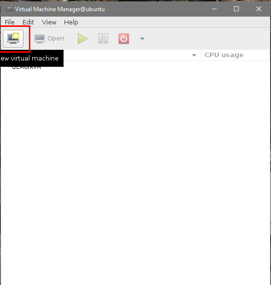
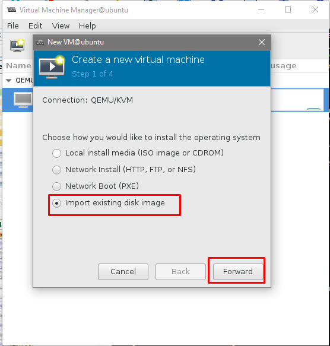
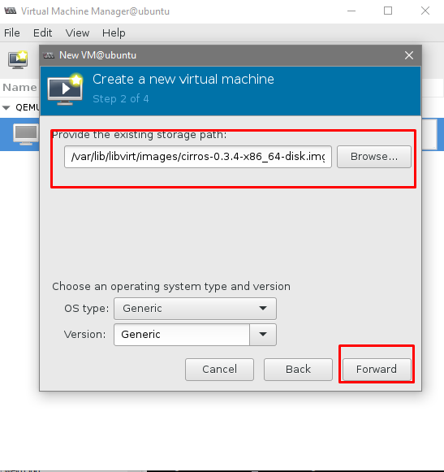
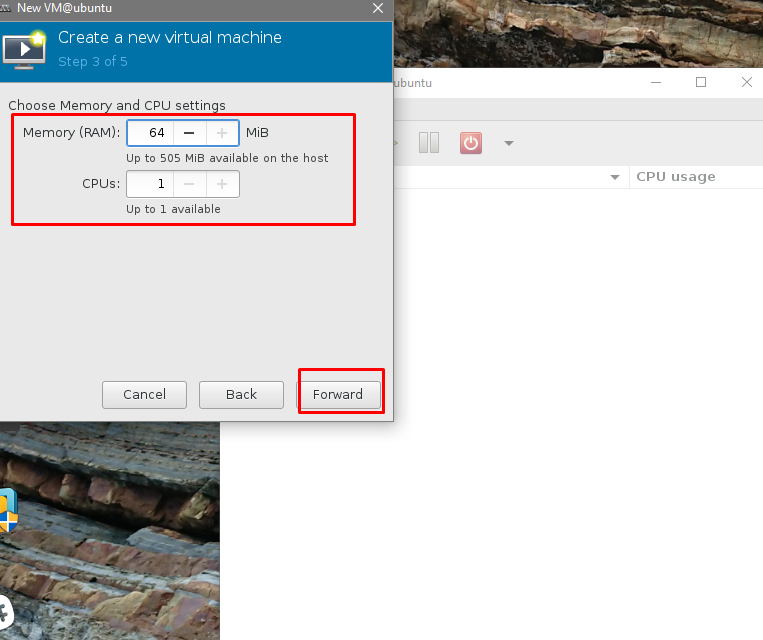
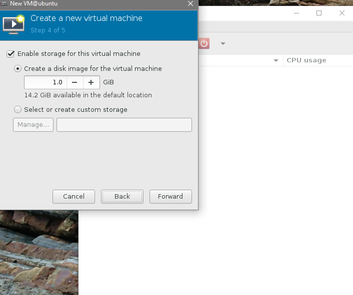
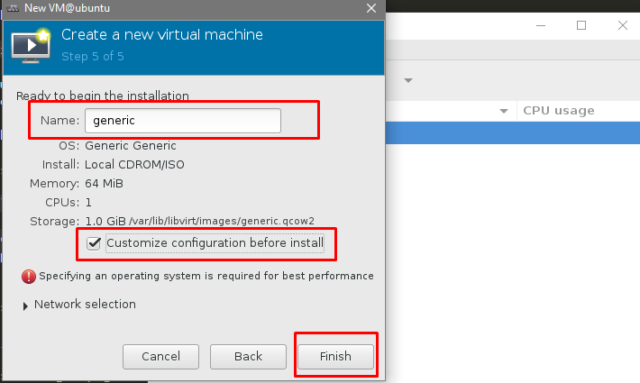

## Tạo máy ảo


1. [Virt-manager](#virt-manager)
2. [Virt-install](#virt-install)
3. [Webvirt](#webvirt)

<a name="virt-manager"></a>
### 1. Tạo máy ảo bằng virt-manager

Cài đặt virt-manager

	apt-get install virt-manage

Mặc định, các file ISO sẽ được lưu ở trong thư mục `/var/lib/libvirt/images/`

Tải một image nhẹ để test tạo máy ảo

	cd /var/lib/libvirt/images/
	wget http://download.cirros-cloud.net/0.3.4/cirros-0.3.4-x86_64-disk.img

Kích hoạt virt-manager

	virt-manager

Nếu sử dụng MobaXterm để ssh tới thì mặc định đã hỗ trợ forward X11, nếu sử dụng các công cụ khác cần kích hoạt chế độ này thì mới có thể sử dụng virt-manager.

Sau khi câu lệnh trên được thực hiện sẽ hiện ra giao diện của virt-manager



Chọn `new` để tạo máy ảo mới, Chọn cách để cài máy ảo

* `Local install media` nếu muốn cài từ file iso
* `Import existing disk image` nếu bạn muốn cài từ file image
* Còn lại là lựa chọn cài từ mạng ngoài



Ở đây, tôi chọn kiểu cài file ISO, chọn `Browse` để tìm các file ISO có sẵn trên máy (bên trên đã tải về)



Chọn RAM và CPU 



Chọn dung lượng ổ đĩa



Đặt tên cho máy ảo và tùy chọn `Customize configuration before install` nếu muốn xem lại hoặc thay đổi các cấu hình trước khi bắt đầu OS



Chọn `Begin Installation` để bắt đầu tạo máy ảo, đợi một lúc cho nó khởi động lên:


<a name="virt-install"></a>
### 2. Virt-install

`virt-install` là một phần của gói `virtinst`, nên cần cài đặt gói này

	sudo apt install virtinst

Có một số tùy chọn sẵn để sử dụng virt-install. Ví dụ:

```sh
sudo virt-install -n VM01 -r 128 \
--disk path=/var/lib/libvirt/images/web_devel.img,bus=virtio,size=4 -c \
ubuntu-18.04-server-i386.iso --network network=default,model=virtio \
--graphics vnc,listen=0.0.0.0 --noautoconsole -v
```

`-n web_devel` chỉ định tên máy ảo mới là `web_devel`

`-r 512` xác định dung lượng bộ nhớ mà máy ảo sử dụng, đơn vị là megabytes.

`-disk path=/var/lib/libvirt/images/web_devel.img,size=4` cho biết đường dẫn đến đĩa ảo có thể là file, partition hoặc logical volume, ở ví dụ này là `web_devel.img` trong thư mục `/var/lib/libvirt/images/`, với kích thước là 4 gigabytes, và sử dụng virtio cho disk bus.

`-c ubuntu-18.04-server-i386.iso` file được sử dụng như một CDROM ảo. 

`--network` cung cấp chi tiết các về interface của VM. Ở đây là `default` network được sử dụng, và interface model được cấu hình cho virtio.

`--noautoconsole`: sẽ không tự động kết nối tới console của máy ảo.

`-v` tạo một máy hoàn toàn được ảo hóa.
 

#### 2.1 Tạo máy ảo bằng file image

Tải file image (tương tự như file ghost) để vào thư mục `/var/lib/libvirt/images/`, ví dụ:

	wget http://download.cirros-cloud.net/0.3.4/cirros-0.3.4-x86_64-disk.img

Tạo máy ảo:

```sh
sudo virt-install \
-n VM01 \
-r 128 \
--vcpus 1 \
--os-variant=generic \
--disk path=/var/lib/libvirt/images/cirros-0.3.4-x86_64-disk.img,format=qcow2,bus=virtio,cache=none \
--network bridge=br0 \
--hvm --virt-type kvm \
--vnc --noautoconsole \
--import
```

Trong đó: 

* n: tên máy ảo
* r: bộ nhớ ram
* vcpu là số cpu
* os variant : các tùy chon cho hệ điều hành
* disk path: đường đẫn đến file img trong máy
* hvm: sử dụng đầy đủ các tính năng ảo hóa
* brigde: tên Linux brigde đã cấu hình
* vnc: đưa ra giao diện ảo vnc để điều khiển VM .
* noautoconsole: không tự động kết nối tới guest console

**Note**: Nếu muốn tạo thêm một máy ảo nữa cũng sử dụng image trên thì thêm tùy chọn `--check all=off`. Nếu muốn hiển thị giao diện console sau khi máy ảo khởi động thì bỏ option `noautoconsole` đi.

#### 2.2 Tạo máy ảo bằng file iso

```sh
virt-install --name vmname --ram 1024 --vcpus=1 \
--disk path=/var/lib/libvirt/images/vmname.img,size=20,bus=virtio \
--network bridge=br0 \
--cdrom /home/tannt/ubuntu-14.04.4-server-amd64.iso \
--console pty,target_type=serial --hvm \
--os-variant ubuntutrusty --virt-type=kvm --os-type Linux
```

Sau khi chạy lệnh sẽ hiển thị một giao diện virt-manager để cấu hình. Nếu không muốn hiển thị giao diện này thì thêm option `--graphics none`

#### 2.3 Tạo máy ảo bằng cách tải trực tiếp các gói trên mạng về rồi cài đặt

```sh
virt-install \
--name template \
--ram 1024\
--disk path=/var/kvm/images/template.img,size=20 \
--vcpus 1 \
--os-type linux \
--os-variant ubuntutrusty \
--network bridge=br0 \
--graphics none \
--console pty,target_type=serial \
--location 'http://jp.archive.ubuntu.com/ubuntu/dists/trusty/main/installer-amd64/' \
--extra-args 'console=ttyS0,115200n8 serial'
```

Trong đó:

* `--location` chỉ đường link để download các file cài đặt về.

Sau đó sẽ hiện lên giao diện cài đặt bình thường như cài đặt một hệ điều hành, các bước tương tự.


<a name="webvirt"></a>
### 3. Webvirt

Hiện nay có 3 cách để triển khai webvirt: 

* Cài đặt KVM và webvirt trên một máy
* Cài đặt KVM và webvirt trên hai máy khác nhau
* Cài đặt webvirt ngay trên máy ảo của KVM

Phổ biến nhất là mô hình thứ 2, và tôi sẽ đề mô về mô hình này

#### Mô hình

Server:

	OS: ubuntu16.04
	IP: 192.168.60.134/24

Client: 
	
	OS: ubuntu 16.04
	IP: 192.168.60.129/24

#### Cài đặt

Cài các gói mạng cần thiết:

	sudo apt-get install git python-pip python-libvirt python-libxml2 novnc supervisor nginx

Cài đặt python, các gói cần thiết và thiết lập môi trường cho Django

```sh
git clone git://github.com/retspen/webvirtmgr.git
cd webvirtmgr
sudo pip install -r requirements.txt # or python-pip (RedHat, Fedora, CentOS, OpenSuse)
./manage.py syncdb
./manage.py collectstatic
```

Sau đó cấu hình cho webvirt

```
You just installed Django's auth system, which means you don't have any superusers defined.
Would you like to create one now? (yes/no): yes (Put: yes)
Username (Leave blank to use 'admin'): admin (Put: your username or login)
E-mail address: username@domain.local (Put: your email)
Password: xxxxxx (Put: your password)
Password (again): xxxxxx (Put: confirm password)
Superuser created successfully.
```

Có thể cài quyền quản trị cao nhất cho supper user

	./manage.py createsuperuser

Ở đây mặc định user sẽ là `root` và nhập pass cho user

Cấu hình nginx

```sh 
mkdir /var/www
cd ..
sudo mv webvirtmgr /var/www/
```

Thêm file cấu hình `webvirtmgr.conf` vào trong `/etc/nginx/conf.d`:

```sh
$ vi /etc/nginx/conf.d/webvirtmgr.conf

server {
    listen 80 default_server;

    server_name $hostname;
    #access_log /var/log/nginx/webvirtmgr_access_log; 

    location /static/ {
        root /var/www/webvirtmgr/webvirtmgr; # or /srv instead of /var
        expires max;
    }

    location / {
        proxy_pass http://127.0.0.1:8000;
        proxy_set_header X-Real-IP $remote_addr;
        proxy_set_header X-Forwarded-for $proxy_add_x_forwarded_for;
        proxy_set_header Host $host:$server_port;
        proxy_set_header X-Forwarded-Proto $scheme;
        proxy_connect_timeout 600;
        proxy_read_timeout 600;
        proxy_send_timeout 600;
        client_max_body_size 1024M; # Set higher depending on your needs 
    }
}
```

Comment `:16,66s/^/#`

cat /etc/libvirt/libvirtd.conf | egrep -v "^$|^#"


## Tham khảo

https://github.com/retspen/webvirtmgr/wiki/Install-WebVirtMgr

https://github.com/MinhKMA/meditech-thuctap/blob/master/MinhNV/KVM/docs/th%E1%BB%B1c%20h%C3%A0nh/install_webvirt_U14.md